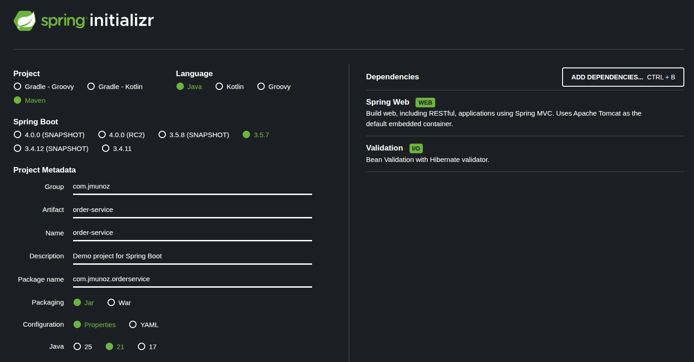
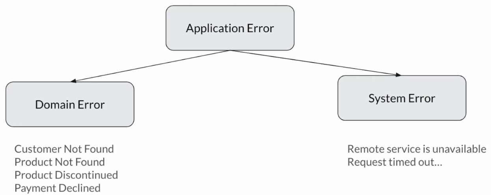
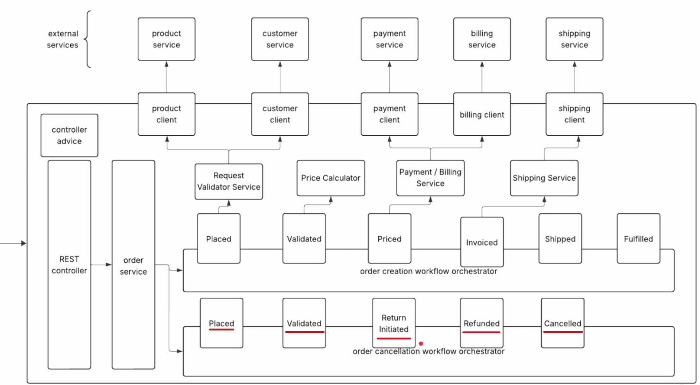

# Order Processing

Proyecto hecho en Spring Boot para comprender mejor lo aprendido durante el curso de `Data Oriented Programming`.

Esta documentación es sobre lo que hago en el código.

La documentación sobre el proyecto está en `02-order-processing-workflow`.

Hay distintas fases en la creación de este proyecto, emulando distintos requerimientos a lo largo del tiempo.

Para este proyecto, no olvidar ejecutar el servicio externo: `java -jar external-services.jar`

Documentación Servicio Externo: [README](../02-order-processing-workflow/04-external-services.md)

Swagger: http://localhost:7070/swagger-ui.html

## Phase 1

Documentación: [README](../02-order-processing-workflow/01-order-processing-system-phase-1.md)

## Project Setup

Accedemos a https://start.spring.io/ y generamos el siguiente proyecto:



Abrimos el proyecto y creamos los siguientes paquetes:

- `client`
- `config`
- `controller`
- `exception`
- `model`
- `orchestrator`
- `service`
- `util`

## Creating Models

Nos ayudamos del Swagger del servicio externo, en concreto de `Response body`, para modelar las respuestas de la API del servicio externo.

Creamos las siguientes clases en el paquete indicado (también hemos creado sub-paquetes para organizarlo todo mejor):

- `model`
  - Todas estas clases son los modelos necesarios para hacer las peticiones y obtener las respuestas de los servicios externos.
    - `product`
      - `Product`: Es un `sealed interface` que modela los `records` siguientes: `Single` y `Bundle`.
        - Es la respuesta del servicio `product`.
      - `ProductStatus`: Es un `sealed interface` que modela los `records` siguientes: `Active` y `Discontinued`.
        - Es la respuesta del servicio `product`.
    - `common`
      - `Address`: Es un `record`.
        - También podría haber estado en el sub-paquete `customer`, pero como es posible que se use en otras clases, lo dejamos en `common`.
      - `PriceSummary`: Es un `record`.
        - También podría haber estado en el sub-paquete `invoice`, pero como es posible que se use en otras clases, lo dejamos en `common`.
    - `customer`
      - `Customer`: Es un `sealed interface` que modela los `records` siguientes: `Regular` y `Business`.
        - Es la respuesta del servicio `customer`.
    - `payment`
      - `PaymentRequest`: Es un `record` que modela la petición que haremos al servicio `payment`.
      - `PaymentStatus`: Es un `sealed interface` que modela los `records` siguientes: `Processed` y `Declined`.
        - Es la respuesta del servicio `payment`.
    - `invoice`
      - `InvoiceRequest`: Es un `sealed interface` que modela los `records` siguientes: `Paid` y `Unpaid`.
        - Enviamos este request para generar la factura.
      - `Invoice`: Es un `sealed interface` que modela los `records` siguientes: `Paid` y `Unpaid`.
        - Es la respuesta del servicio externo.
    - `shipping`
      - `Recipient`: Es un `record`.
      - `ShipmentItem`: Es un `record`.
      - `ShippingRequest`: Es un `record` que modela la petición que haremos al servicio `shipping`.
      - `TrackingDetails`: Es un `record`.
      - `Shipment`: Es un `record`.
      - `ShippingResponse`: Es un `record` que modela la respuesta que obtendremos del servicio `shipping`.
  - Todas estas clases son los modelos necesarios para hacer las peticiones y obtener las respuestas de nuestro servicio. Estos modelos tienen validaciones y hacemos diferentes modelos (DTO y modelos que pasan al orchestrator)
  - En los DTO lo que nos importa es la serialización, deserialización y validaciones de las peticiones, y no queremos mezclar estas responsabilidades con los modelos que llegan al orchestrator.
    - `order`
      - `OrderRequest`: Es un `record` con la petición que nos hacen desde el cliente a nuestro servicio.
        - Con validaciones. Es un DTO
      - `CreateOrderCommand`: Es un `record` con la data de la orden que llega al orchestrator desde el DTO.
      - `OrderItem`: Es un `record` para el orchestrator.
      - `Order`: Es un `record` para el orchestrator.
      - `OrderResponse`: Es un `record` con la respuesta que devolvemos al cliente. Contiene los `record` internos `Product` y `InvoiceDetails`.

## Modeling Errors

Cuando ocurra un error queremos parar el flujo de trabajo, ya que no vamos a poder completar la orden y, por tanto, no tiene sentido continuar.

Los errores los vamos a modelar de esta forma:



Tendremos una aplicación general de error, que será un `sealed interface` que permite los `sealed interfaces` siguientes: `DomainError` y `SystemError`.

`DomainError` son errores del dominio del negocio y `SystemError` son errores que ocurren fuera de nuestro control.

Creamos las siguientes clases en el paquete indicado:

- `exception`
  - `ApplicationError`: Es un `sealed interface` que permite las `sealed interafaces` siguientes: `DomainError` y `SystemError`.
  - `DomainError`: Es un `sealed interface` con los `records` siguientes: `EntityNotFound`, `ProductDiscontinued` y `PaymentDeclined`.
  - `SystemError`: Es un `sealed interface` con el `record` siguiente: `RemoteServiceError`.

## Application Exceptions

Una vez modelados los errores, vamos a crear los `RuntimeException` como tales.

Creamos las siguientes clases en el paquete indicado:

- `exception`
  - `ApplicationException`: Es el `RuntimeException`.
  - `ApplicationExceptions`: Es una utility class con muchos métodos `factory` estáticos cuya misión es lanzar las excepciones.

## [Clarification] - Why Do We Have Interface For Single Implementation?

Creamos una interface para cada servicio, aunque solo vaya a tener una implementación, primero para cumplir el principio de Inversión de Dependencia.

Es decir, queremos que nuestro orchestrator (o clases de servicio) dependa de interfaces (o clases abstractas) en vez de en implementaciones concretas.

Esto es porque en el futuro podríamos querer usar una implementación diferente, por ejemplo usar gRPC para hablar con los servicios externos.

El segundo objetivo de usar interfaces es también para establecer contratos claros.

## Product Client - Implementation

Creamos las siguientes clases en el paquete indicado:

- `client`
  - `ProductClient`: Es una interface que modela el comportamiento.
  -  `impl`
    - `AbstractServiceClient`: Es una clase abstracta que gestiona el manejo de excepciones (en vez de hacerlo en `ProductServiceClient` y los demás).
    - `ProductServiceClient`: Implementación de `ProductClient`.

## Customer Client & Payment Client

Creamos las siguientes clases en el paquete indicado:

- `client`
  - `CustomerClient`: Es una interface que modela el comportamiento.
  - `PaymentClient`: Es una interface que modela el comportamiento.
  -  `impl`
    - `CustomerServiceClient`: Implementación de `CustomerClient`.
    - `PaymentServiceClient`: Implementación de `PaymentClient`.

## Billing Client & Shipping Client

Creamos las siguientes clases en el paquete indicado:

- `client`
  - `BillingClient`: Es una interface que modela el comportamiento.
  - `ShippingClient`: Es una interface que modela el comportamiento.
  -  `impl`
    - `BillingServiceClient`: Implementación de `BillingClient`.
    - `ShippingServiceClient`: Implementación de `ShippingClient`.

## Request Validator Service

Habiendo terminado con los clientes, nos enfocamos ahora en los services que llaman a esos clientes.

Al igual que hicimos con los clientes, vamos a definir interfaces y crearemos la implementación de estas clases de servicio.

Al hacer una petición a nuestro controller, acabamos creando un objeto `CreateOrderCommand` que pasa al orchestrator (fase Placed) y a `RequestValidatorService`.

En la clase de servicio `RequestValidatorService` se van a hacer validaciones de dominio. En concreto, si ha podido obtener información del producto y del cliente.

Si todo va bien, convertiremos la respuesta en un objeto Order.

Por tanto, ese es el objetivo de `RequestValidatorService`, hacer validaciones de dominio y crear el objeto Order.

Creamos las siguientes clases en el paquete indicado:

- `service`
  - `RequestValidatorService`: Es una interface que modela el comportamiento. Validará si obtiene la data correcta de los clientes `Product` y `Client` y creará objeto Order.
  - `impl`
    - `RequestValidatorServiceImpl`: Implementación de `RequestValidatorService`.

## Price Calculator

Habiendo terminado `RequestValidatorService`, hemos transformado `CreateOrderCommand` en un objeto `Order`.

Como parte de la siguiente fase del orchestrator (fase Validated) vamos a usar `PriceCalculator` para, usando el objeto `Order`, calcular el precio.

Creamos las siguientes clases en el paquete indicado:

- `service`
  - `PriceCalculator`: Es una interface que modela el comportamiento. Dado el objeto `Order` calculará el precio.
  - `impl`
      - `PriceCalculatorImpl`: Implementación de `PriceCalculator`.

## Payment & Billing Service

Una vez calculados los detalles del precio, el próximo paso es llamar a Payment/Billing Service. Este servicio es el que llamará a los clientes payment y billing.

Creamos las siguientes clases en el paquete indicado:

- `service`
  - `PaymentBillingService`: Es una interface que modela el comportamiento. Realiza el pago y crea la factura.
  - `impl`
      - `PaymentBillingServiceImpl`: Implementación de `PaymentBillingService`.

## Shipping Service

Una vez generada la factura, el siguiente paso es llamar al servicio shipping para planificar el envío.

Creamos las siguientes clases en el paquete indicado:

- `service`
  - `ShippingService`: Es una interface que modela el comportamiento. Realiza el envío.
  - `impl`
      - `ShippingServiceImpl`: Implementación de `ShippingService`.

## Order States

Vamos a centrarnos ahora en definir los estados de la orden y las transiciones entre estados, es decir, la implementación del orchestrator.

Para transiciones entre estados, vamos a usar el mismo concepto que vimos aquí: [Loan Models](../01-dop-playground/README.md#loan-models). Ver `LoanStatus`, `LoanProcessor` y `LoanProcessorImpl`.

El orchestrator va a recibir un objeto `CreateOrderCommand` en la primera fase Placed del orchestrator. Luego en la fase Validated ya tenemos un objeto Order.

En la tercera fase Priced ya tenemos tanto un objeto Order como un objeto PriceSummary. En la cuarta fase Invoiced ya tenemos tanto un objeto Order como un objeto Invoice.

Para la quinta fase Shipped ya tenemos objetos Order, Invoice y la lista de Shipment. En este punto ya podemos asumir que el trabajo está hecho y que la orden está completada, así que transicionamos al estado Fulfilled.

Creamos las siguientes clases en el paquete indicado:

- `orchestrator`
  - `OrderState`: Es un `sealed interface` que define los `records` siguientes: `Placed`, `Validated`, `Priced`, `Invoiced`, `Shipped` y `Fulfilled`.

## Order Orchestrator - State Transition

En esta clase nos enfocamos en el orchestrator, que es el responsable de la transición de estados.

Creamos las siguientes clases en el paquete indicado:

- `orchestrator`
  - `OrderOrchestrator`: Es una interface que modela el comportamiento para realizar la transición entre los distintos estados.
  - `impl`
    - `OrderOrchestratorImpl`: Implementación de la interface `OrderOrchestrator`.

## [Clarification] - Do We Need Fulfilled State?

Una vez la orden se ha enviado, ¿por qué no devolvemos directamente el estado en `OrderOrchestrator`, en vez de pasar al estado Fulfilled?

Realmente ya hemos terminado. ¿Por qué necesitamos el paso innecesario a Fulfilled?

No queremos asumir con seguridad que el estado Shipped en el último estado. ¿Por qué? Porque el negocio siempre está pidiendo nuevos requerimientos, o cambiando los requerimientos existentes.

Hoy, el estado Shipped es el último paso, pero mañana puede llegar un nuevo requerimiento que indique que, una vez la orden se ha enviado, se envíe un email al cliente, una notificación.

En ese caso, tendríamos que introducir un nuevo estado llamado, por ejemplo, Notify.

Es por eso que no podemos asumir que Shipped sea el último estado y, lo que hacemos, es indicar un estado Fulfilled que está completamente dedicado a ser el último estado.

## Order Service & Mapper

OrderService va a recibir OrderRequest y, una vez la orden ha pasado al estado Fulfilled, va a devolver OrderResponse.

Creamos las siguientes clases en los paquetes indicados:

- `service`
  - `OrderService`: Es una interface que modela el comportamiento. Recibe OrderRequest y devolverá OrderResponse.
  - `impl`
    - `OrderServiceImpl`: Implementación de la interface `OrderService`.
- `util`
  - `DomainDtoMapper`: Hace mapeos de OrderRequest a CreateOrderCommand y también mapeamos a OrderResponse a partir de Order, Invoice y List<Shipment>

## Order REST Controller

Vamos a trabajar en el controller.

Creamos las siguientes clases en el paquete indicado:

- `controller`
  - `OrderController`: El controlador de nuestra aplicación.

## @ControllerAdvice - Problem Detail - Application Exception Handling

Vamos a trabajar en el Controller Advice.

Para saber más sobre Problem Detail ver: https://github.com/JoseManuelMunozManzano/Spring-WebFlux-Masterclass-Reactive-Microservices/tree/main/01-webflux-playground#problem-detail

Creamos las siguientes clases en el paquete indicado:

- `controller`
  - `advice`
    - `ApplicationExceptionHandler`: Es el Controller Advice.

## Logging Interceptor

Ya hemos terminado con todo salvo con el paquete `config`. Aquí es donde vamos a exponer los beans de Spring y donde vamos a tener la configuración relacionada con la deserialización polimórfica, como mixin, etc.

Creamos las siguientes clases en el paquete indicado:

- `config`
  - `LoggingInterceptor`: Para poder hacer debug fácilmente vamos a hacer log en cada request que se envíe.

## Application Configuration

Creamos las siguientes clases en el paquete indicado:

- `config`
  - `ApplicationConfiguration`: Clase de configuración de beans de Spring.
    - Se añade a RestClient `LoggingInterceptor`.

## Jackson Mixin

En esta clase vamos a crear los varios mixin necesarios para hacer la deserialización polimórfica.

Hay varios `sealed interfaces` para los que no creamos clases mixin, pero es porque esos tipos no están involucrados en deserializaciones.

Indicar que para realizar serializaciones no tenemos problemas, es solo para deserializar cuando Jackson tiene que tener claro a qué objeto hacerlo.

Creamos las siguientes clases en el paquete indicado:

- `config`
  - `CustomerMixIn`: Clase de configuración para poder hacer deserialización polimórfica.
  - `ProductMixIn`: Clase de configuración para poder hacer deserialización polimórfica.
  - `ProductStatusMixIn`: Clase de configuración para poder hacer deserialización polimórfica.
  - `InvoiceMixIn`: Clase de configuración para poder hacer deserialización polimórfica.

## Final Demo Preparation

Ver: [Final Demo](../02-order-processing-workflow/01-order-processing-system-phase-1.md#final-demo)

En la carpeta `postman` se encuentra un fichero de Postman para importar y hacer pruebas.

Creamos las siguientes properties:

- `application.properties`

```sql
product.service.url=http://localhost:7070/products
customer.service.url=http://localhost:7070/customers
payment.service.url=http://localhost:7070/payment
billing.service.url=http://localhost:7070/billing
shipping.service.url=http://localhost:7070/shipping
```

## Final Demo

Los tests que hacemos son, usando Postman:

- `phase-1`
  - `01-customer-id-null`: Como estamos usando Jakarta Validation, obtendremos como respuesta `Bad Request` porque customer es null.
  - `02-zero-quantity`: Como estamos usando Jakarta Validation, obtendremos como respuesta `Bad Request` porque quantity es 0.
  - `03-product-not-found`: Se pasan las Jakarta Validation, pero obtendremos como respuesta `Not Found` porque el producto no existe.
  - `04-customer-not-found`: Se pasan las Jakarta Validation, pero obtendremos como respuesta `Not Found` porque el cliente no existe.
  - `05-product-discontinued`: Se pasan las Jakarta Validation, pero obtendremos como respuesta `Product Discontinued` porque el producto está discontinuado.
  - `06-payment-declined`: Se pasan las Jakarta Validation, pero obtendremos como respuesta `Payment Required`.
  - `07-regular-user-single-product`: Camino feliz para un pedido regular de un solo producto.
  - `08-regular-user-bundle-product`: Camino feliz para un pedido regular de varios productos.
  - `09-business-user-single-product`: Camino feliz para un pedido business de un solo producto.
  - `10-business-user-bundle-product`: Camino feliz para un pedido business de varios productos.
  - `11-business-user-unpaid-invoice`: Para un negocio, generamos una factura correcta con `paymentStatus` con valor `Unpaid` y una fecha de `paymentDue`.
  - Error de sistema `Service Unavailable`: Para poder simular esto, ir a `application.properties` e indicar `payment.service.url=http://localhost:7070/payment_error`.
    - `PaymentService` devolverá status 404 porque no es un path válido. Este status no está manejado en `PaymentClient` por lo que se convertirá en un `SystemError`.
    - Probar ahora de nuevo en Postman, por ejemplo, `11-business-user-unpaid-invoice`.
  - Volver a dejar bien `application.properties`.

## [Clarification] - Order Cancellation Workflow Orchestrator

Hemos visto como implementar el flujo de trabajo de creación de una orden.

Igualmente, si tenemos más flujos de trabajo en nuestra aplicación, como un flujo de trabajo de cancelación de orden, podemos crear otro orchestrator para manejar esto.



Podemos tener estados relacionados con la cancelación de pedidos y su correspondiente orchestrator para realizar la transición entre estados.

Por ejemplo, podemos hacer, en el estado `Placed`, validaciones de que la orden puede cancelarse solo en los primeros treinta días antes del pasar al estado `Validated`.