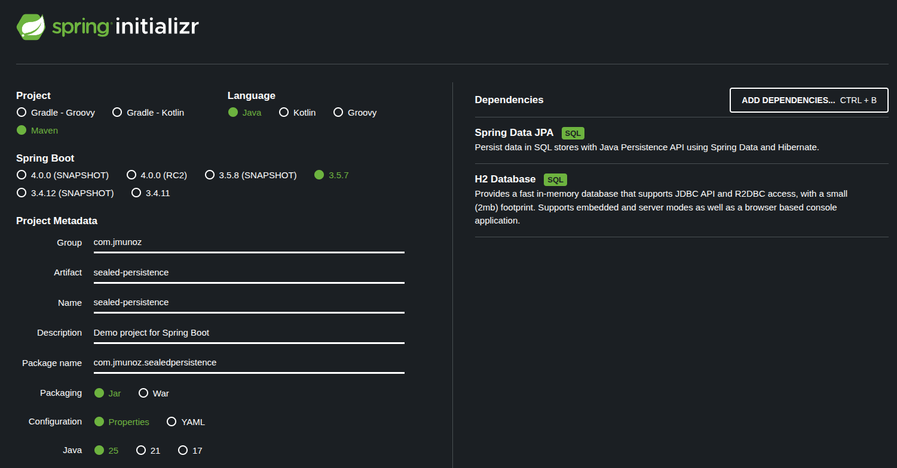
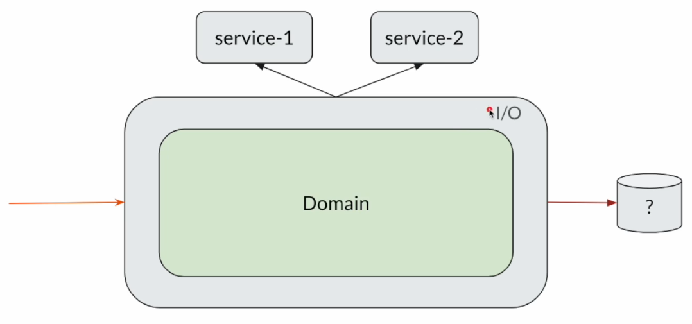
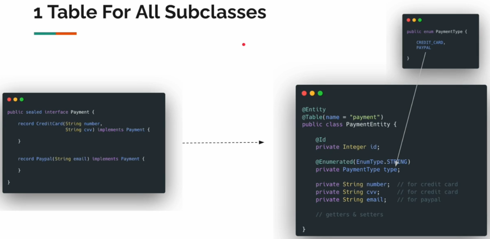
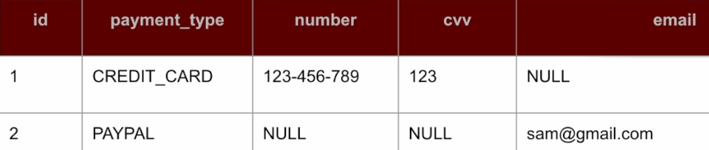
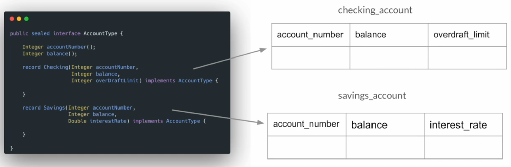
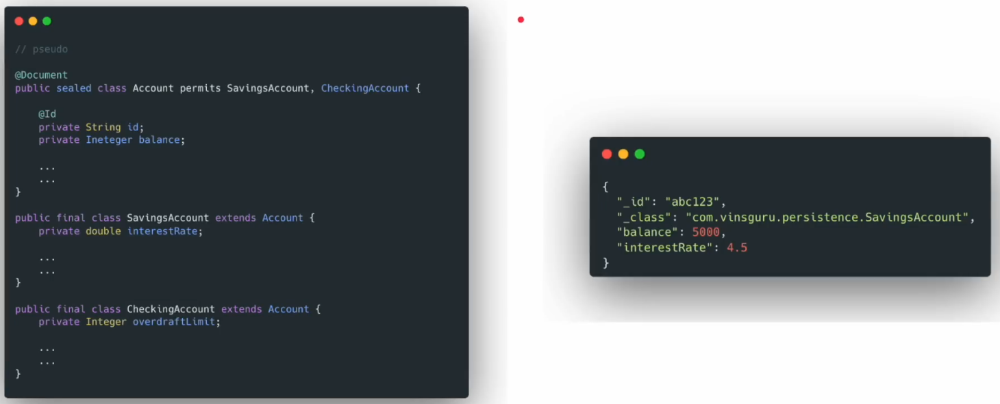

# Sealed Persistence

## Project Setup

Accedemos a https://start.spring.io/ y generamos el siguiente proyecto:



### Sealed Types With Persistence



Hemos desarrollado una aplicación y hemos visto como modelar el dominio usando tipos `sealed`, llamando a servicios externos y haciendo transiciones entre estados.

Pero, ¿qué ocurre con la persistencia? Es decir, si usamos tipos `sealed`, ¿cómo podemos almacenarlos en una BD?

**Suposición**

- Los conceptos DOP pueden parecer excesivos para una sencilla aplicación CRUD.
- Asumimos que usamos estos conceptos en aplicaciones relativamente grandes.

**Sealed Types --> DB**

Cuando usamos bases de datos relacionales, tenemos dos enfoques diferentes:

- 1 tabla para todas las subclases.
- 1 tabla por subclase.

### 1 Table For All Subclasses



Imaginemos que en nuestra aplicación tenemos un tipo `sealed` llamado `Payment` con dos diferentes posibilidades, `CreditCard` y `Paypal`.

Usando estas opciones, el usuario puede solicitar un producto.

Una vez la orden se ha completado, queremos almacenar la opción `Payment` en base de datos.

Como tenemos dos opciones diferentes, ¿cómo lo hacemos? Esto es lo que vamos a discutir.

Un enfoque es usar una tabla para todas las subclases. Cuando decimos subclases nos referimos a las posibilidades, que en este ejemplo son `CreditCard` y `Paypal`.

Para esto, tendremos una tabla llamada `payment` (recordar que la persistencia es aparte) y, para representar la tabla tendremos una clase `entity` llamada `PaymentEntity`.

En la entity vemos que hay un `enum` llamado `type` que representa las dos opciones de pago disponibles.

Luego, vemos que todos los `record components` deben aparecer en la entidad.

Nuestra tabla `payment` de base de datos será más o menos así:



Dependiendo del tipo de pago seleccionado por el cliente, algunos campos serán null.

En `src/java/com/jmunoz/sec01` creamos los packages/clases siguientes:

- `application`: Es el paquete donde tendremos nuestros modelos, clases de servicio, haremos las transiciones entre estados
  - `model`
    - `Payment`: Es una `sealed interface` que contiene los `records` siguientes: `CreditCard` y `Paypal`.
  - `util`
    - `DomainEntityMapper`: Hacemos el mapeo desde el modelo de dominio a la entidad y al revés.
  - `service`
    - `PaymentService`: La clase de servicio.
- `persistence`: Es el paquete donde tendremos entidades y repositorios.
  - `entity`
    - `PaymentEntity`: La representación en Java de la tabla `payment` de BD.
    - `PaymentType`: Es un `enum` con las mismas posibilidades que ofrece el model `Payment`, es decir `CREDIT_CARD` y `PAYPAL`.
  - `repository`
    - `PaymentRepository`: El repositorio.

En `test/java/com/jmunoz/sealedpersistence` creamos el test siguiente:

- `OneTableApproachTest`: No es realmente un test, es más lanzar una ejecución de la aplicación.

En `application.properties` añadimos, para ver las sentencias SQL:

```
spring.jpa.show-sql=true
```

Tenemos que ejecutar la clase de test para probar.

### 1 Table Per Subclass



En este enfoque, como parte de nuestra aplicación, imaginemos que tenemos un tipo `sealed` llamado `AccountType` y podemos elegir entre dos tipos de cuenta, `Checking` y `Savings`.

En vez de usar una sola table para almacenar esta información, vamos a almacenar la información relacionada con la cuenta `Checking` en la tabla `checking_account`, y la información relacionada con la cuenta `Savings` en la tabla `savings_account`.

En `src/java/com/jmunoz/sec02` creamos los packages/clases siguientes:

- `application`: Es el paquete donde tendremos nuestros modelos, clases de servicio, haremos las transiciones entre estados
    - `model`
      - `AccountType`: Es una `sealed interface` que contiene los `records` siguientes: `Checking` y `Savings`.
    - `util`
      - `DomainEntityMapper`: Hacemos el mapeo desde el modelo de dominio a la entidad y al revés.
    - `service`
      - `AccountService`: La clase de servicio.
- `persistence`: Es el paquete donde tendremos entidades y repositorios.
    - `entity`
      - `Account`: Clase abstracta con los campos en común de `CheckingAccount` y `SavingsAccount`.
      - `CheckingAccount`: La representación en Java de la tabla `checking_account` de BD.
      - `SavingsAccount`: La representación en Java de la tabla `savings_account` de BD.
    - `repository`
      - `AccountRepository`: El repositorio.

En `test/java/com/jmunoz/sealedpersistence` creamos el test siguiente:

- `TablePerClassApproachTest`: No es realmente un test, es más lanzar una ejecución de la aplicación.

Tenemos que ejecutar la clase de test para probar.

### What About Document DB?



Los enfoques anteriores trataban bases de datos relacionales. Pero, ¿qué pasa si queremos usar MongoDB u otra base de datos de documentos?

Si usamos MongoDB con Spring Data, manejar clases `sealed` es mucho más fácil y menos problemático que Hibernate.

En MongoDB podemos almacenar fácilmente data semiestructurada. No crea clases proxy en tiempo de ejecución, así que podemos usar `sealed types` si queremos.

En la imagen podemos ver dos tipos diferentes de `Account`. Si queremos almacenarlo usando `Spring Data Repository` podemos usar esto.

Como vemos en la parte derecha de la imagen, al guardar, aparece la propiedad `_class` donde vemos el origen `SavingsAccount`.

Si queremos obtener información de la base de datos, podemos decodificar esto en `SavingsAccount` fácilmente.