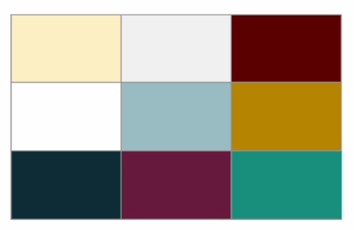
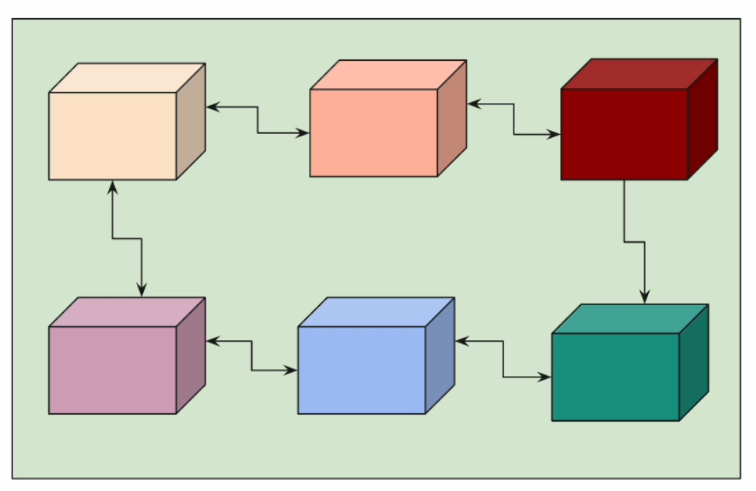
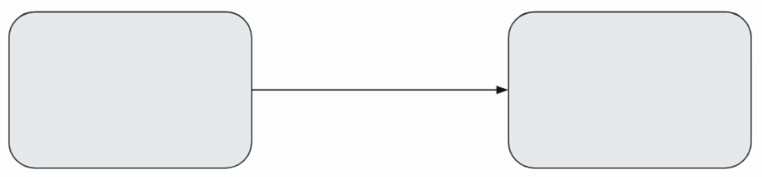
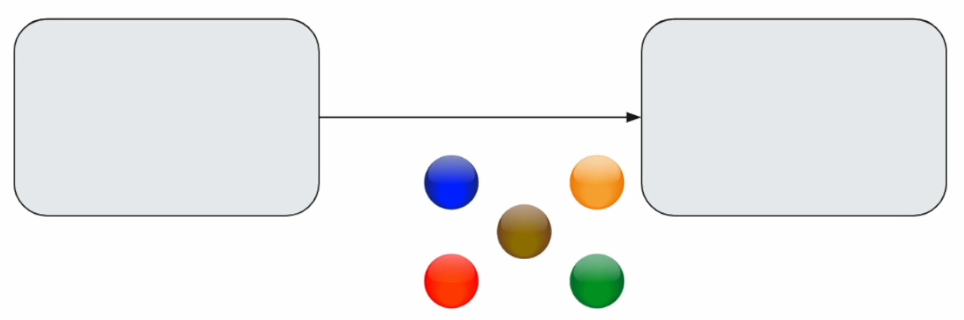

# Modern Java: Data Oriented Programming Masterclass

Del curso de Udemy: https://www.udemy.com/course/java-data-oriented-programming/

## Introduction

Java siempre ha sido un lenguaje orientado a objetos. Es un enfoque de programación donde la data y las acciones (comportamiento) que operan sobre esa data están agrupados en objetos.

Este enfoque funciona realmente bien cuando estamos construyendo aplicaciones monolíticas donde diferentes módulos hablan entre ellos pasándose objetos que incluyen tanto data como lógica.

Pero los tiempos han cambiado. Hoy, en arquitectura basada en microservicios, ese enfoque orientado a objetos tradicional puede sentirse limitante.

Miremos este ejemplo: Imaginemos que tenemos dos servicios:

El servicio de la izquierda, `order service` quiere obtener el detalle de los productos del servicio de la derecha, `product service`.

En el modelo tradicional, `product service` devuelve la respuesta exitosa `product` o respuesta con error (quizás 404 - product not found). Esta comunicación tradicional es de respuestas fijas, muy rígida.

Necesitamos respuestas ricas y contextuales, pero en la programación tradicional los servicios están normalmente diseñados solo para decir si o no. Aquí es donde entra `data oriented programming`.

**Data Oriented Programming**

- No se trata solo de estilo de codificación.
- Se trata de modelar claramente la data, expresando intención con precisión, y haciendo la comunicación flexible e informativa.

Los microservicios pueden hablar como lo hacemos los humanos en vez de respuestas rígidas de tipo si o no.

Por ejemplo, las distintas bolas representan estas respuestas:

- `producto discontinuado. Estas son las alternativas`.
- `El producto ya no está en stock, pero viene en dos días`.
- `Si, tengo el producto`.

Ya no se trata solo de comunicación entre microservicios, sino que podemos usar estos conceptos para diseñar flujos de trabajo empresariales complejos dentro de una aplicación.

Esto lo podremos ver en una aplicación con Spring Boot que vamos a construir más adelante para ver todo lo que se ha aprendido en el curso.

**What Will You Learn?**

- Comprender los principios de `Data Oriented Programming` (DOP) y como remodela el diseño de aplicaciones modernas.
- Modelar dominios de negocio usando estructuras de datos claras, expresivas, impulsadas por la intención.
- Mejorar la comunicación entre servicios a través de tipos de datos bien definidos y con significado.
- Manejar la incertidumbre y el fallo con más matices que las típicas respuestas rígidas basadas en success/failure.
- Adoptar un cambio de mentalidad. De código que reacciona a código que comunica.

`Data Oriented Programming` puede ayudarnos a desarrollar microservicios que sean fáciles de leer y de mantener, pero para temas de rendimiento y de escalabilidad, aprenderemos en otro curso sobre `Virtual Threads`.

**Syllabus**

- Records
- Sealed Types
- Pattern Matching
- Data Oriented Programming
- Domain Modeling
- Handling Uncertainty
- Error Handling
- DOP: Deserialization Challenges in Microservices
- Application Development

Los tres primeros apartados (Records, Sealed Types y Pattern Matching) son los bloques de construcción básicos para `Data Oriented Programming`.

## Records

[README](./dop-playground/README.md#records)

Ver proyecto `dop-playground`, paquete `sec01`:

- `Lec01RecordBasicsDemo`: Creamos un record dentro de esta clase y exploramos lo básico de los records, como getters, equals, toString...
- `Lec02CanonicalConstructor`: Ejemplo del constructor autogenerado por defecto, llamado Canonical Constructor y el problema que conlleva si el record tiene muchos campos.
- `Lec03CompactConstructor`: Ejemplo con CompactConstructor, que arregla el problema de construir Canonical Constructor.
  - Añadimos validaciones.
- `Lec04NonCanonicalConstructor`: Ejemplo para crear firmas diferentes a la de los componentes del record.
- `Lec05ImmutableRecord`: Ejemplos de inmutabilidad (no lo es al 100%) de los records.
- `Lec06AccessorMethodOverride`: Ejemplos de sobre-escritura del funcionamiento de los métodos getter de los `Records`.
- `Lec07NullableFields`: Vemos diferentes formas de tratar con campos de un `record` que pueden ser nulos.
- `Lec08StaticMembers`: Ejemplos de miembros estáticos y métodos de factoría estáticos.
- `Lec09RecordInterface`: Ejemplo de un `record` implementando una interface.
- `Lec10RecordReflection`: Ejemplos de uso de reflexión.

## Sealed Types

[README](./dop-playground/README.md#sealed-types)

Ver proyecto `dop-playground`, paquete `sec02`:

- `lec01`
    - `Payment`: Clase abstracta.
    - `Cash`: Clase sealed que es permitida que extienda de `Payment` y permite que `CashRewards` la extienda.
    - `CashRewards`: Clase final que es permitida que extienda de `Cash`.
    - `CreditCard`: Clase final que es permitida que extienda de `Payment`.
    - `Demo`: Clase que utiliza nuestra jerarquía de clases creadas anteriormente.

- `lec02`
    - `Payment`: Interface que usa `sealed`.
    - `CreditCard`: Records que es permitido que implemente de `Payment`.
    - `Paypal`: Records que es permitido que implemente de `Payment`.
    - `Demo`: Clase que utiliza nuestra jerarquía de clases creadas anteriormente.