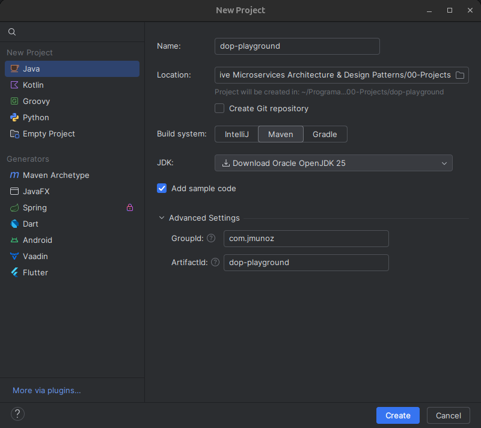
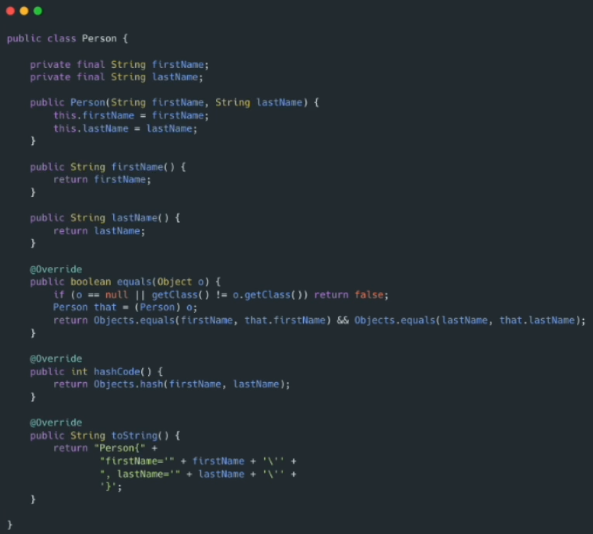
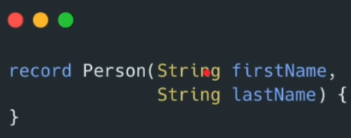
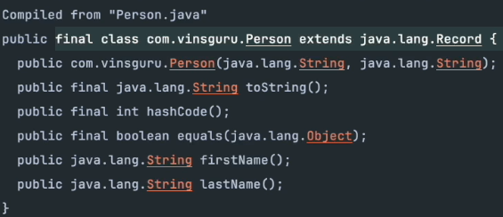
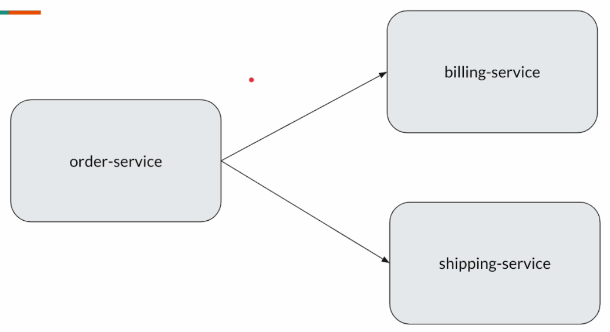
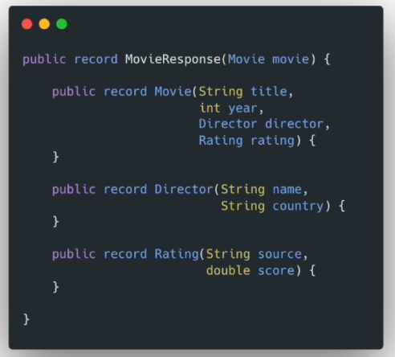
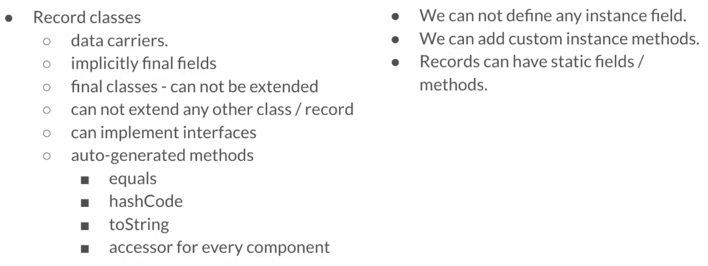

# Data Oriented Programming

## Project Setup

Creamos el proyecto para el estudio de `Data Oriented Programming` en IntelliJ con la siguiente configuración:



Al archivo `pom.xml` se le han añadido las siguientes properties, dependencies y build:

```xml
<properties>
    <logback.version>1.5.19</logback.version>
    <jackson.version>2.20.0</jackson.version>
</properties>

<dependencies>
    <!-- logging library -->
    <!-- https://www.baeldung.com/logback -->
    <dependency>
        <groupId>ch.qos.logback</groupId>
        <artifactId>logback-classic</artifactId>
        <version>${logback.version}</version>
    </dependency>
    <!-- To deserialize json into Java object or vice versa -->
    <dependency>
        <groupId>com.fasterxml.jackson.core</groupId>
        <artifactId>jackson-databind</artifactId>
        <version>${jackson.version}</version>
    </dependency>
</dependencies>

<build>
    <plugins>
        <plugin>
            <groupId>org.apache.maven.plugins</groupId>
            <artifactId>maven-compiler-plugin</artifactId>
            <configuration>
                <source>25</source>
                <target>25</target>
            </configuration>
        </plugin>
    </plugins>
</build>
```

En la carpeta `main/src/resources` se ha creado el archivo `logback.xml`, para formatear los logs, con el siguiente código:

```xml
<!-- http://dev.cs.ovgu.de/java/logback/manual/layouts.html -->
<configuration>
    <appender name="STDOUT" class="ch.qos.logback.core.ConsoleAppender">
        <encoder>
            <pattern>%d{HH:mm:ss.SSS} %-5level [%15.15t] %cyan(%-30.30logger{30}) : %m%n</pattern>
        </encoder>
    </appender>
    <root level="INFO">
        <appender-ref ref="STDOUT" />
    </root>
</configuration>
```

## Records

### How Records Work

Todos hemos escrito `Plain Old Java Objects` (POJO) como estos:



Para una clase `Person` como la que se ve en la imagen, necesitamos construir:

- constructor
- getters
- equals
- hashCode
- toString

Esta es una clase solo para mantener el nombre y el apellido de una persona, pero hay demasiado código involucrado.

Los `Records` de Java solucionan este inconveniente:



A partir de Java 17 se pueden crear `records` como este para modelar data.

Solo con este código obtenemos automáticamente todo el código que vimos en el POJO (constructors, getters...), sin necesidad de `Lombok`.

Los `records` no dejan de ser clases y, cuando se compilan, se puede ver que autogeneran constructores, toString, getters...:



Vemos que los getters no anteponen `get` al nombre. No es `getFirstName()` sino `firstName()`. Esto es porque no hay setters, por lo que no hay que diferenciar entre ellos.

Por tanto:

- Cada record extiende de `java.lang.Record`.
- `Record classes` no pueden extender de otras clases / records.
- Los `Records` son final. Ninguna otra clase puede hacer `extends` de un record.
- Los `Records` no tienen métodos setter.
- Los `Records` están destinados a ser portadores de datos.
- La compilación genera automáticamente lo siguiente:
  - Un constructor.
  - Métodos equals/tostring/hashCode
  - Métodos getter (con exactamente los mismos nombres que los campos)
- Los campos de un `record` se llaman `record components`.
- Se convierten en campos `private final` de la clase compilada.
- `Records` extienden indirectamente de `java.lang.Object`.
  - Person -> java.lang.Record -> java.lang.Object

### Record Equality

En `src/java/com/jmunoz/sec01` creamos las clases siguientes:

- `Lec01RecordBasicsDemo`: Creamos un record dentro de esta clase y exploramos lo básico de los records, como getters, equals, toString...

### Canonical Constructor

En `src/java/com/jmunoz/sec01` creamos las clases siguientes:

- `Lec02CanonicalConstructor`: Ejemplo del constructor autogenerado por defecto, llamado Canonical Constructor y el problema que conlleva si el record tiene muchos campos.

### Compact Constructor

Durante esta clase, vemos que no podemos acceder a `this` en el compact constructor (si en el canonical constructor).


De nuevo, cuando creamos un `record` como el de la parte izquierda de la imagen, el canonical constructor con todos los campos es generado automáticamente por el compilador (normalmente no tenemos que escribirlo nosotros).


Pero, a veces, sí que tenemos que escribir nosotros el canonical constructor, si queremos modificar un valor antes de almacenarlo, como en este caso donde el apellido es transformado a mayúsculas.


Con el compact constructor, aunque su nombre indica la palabra constructor, no es realmente un constructor si no, más bien, una pista que compartimos con el compilador.

Es decir, seguimos queriendo que el compilador genere el código, pero le estamos diciendo al compilador que, cuando asigne los campos, lo haga de la manera que le pedimos.


El compilador acaba creando un constructor como el que se ve en la imagen de arriba, y no podemos usar `this` por eso, porque queremos que el compilador nos genere la parte de asignación de variables.

Si indicásemos `this.lastName = lastName.toUpperCase();` daría error porque el compilador hace después `this.lastName = lastName;` y, como `lastName` es, igual que todos los campos de un record, un `private final`, solo se puede inicializar una vez, con lo que obtenemos un error de compilación.

En `src/java/com/jmunoz/sec01` creamos las clases siguientes:

- `Lec03CompactConstructor`: Ejemplo con CompactConstructor, que arregla el problema de construir Canonical Constructor.

### Compact Constructor - Validation

Como el código del compact constructor se ejecuta primero, es perfecto para hacer validaciones.


En la imagen de arriba puede verse como se implementan las restricciones de negocio en el compact constructor.

También se puede usar la API de Jakarta Validation, con las anotaciones `@NotNull`, etc, pero hay que añadir dependencias externas. Esto lo veremos como parte del proyecto que haremos en Spring Boot.

Por tanto:

- Se recomienda usar Compact Constructor.
- Existe particularmente para añadir la lógica de validación y/o la lógica de procesamiento antes de inicializar los campos.

En `src/java/com/jmunoz/sec01` modificamos la clase siguiente:

- `Lec03CompactConstructor`: Añadimos validaciones.

### Non-Canonical Constructor

Non-canonical constructor es un constructor con una firma diferente a la de los componentes del record.

El caso de uso es el siguiente: Tenemos uno de los campos del record que podría tener un valor por defecto, como el campo `LocalDate createdAt`, pero estamos obligados, al crear una instancia, a darle un valor.

Nos gustaría no tener que indicar ese valor, y asumir que, si no lo enviamos, va a ser el día actual. Aquí es donde Non-canonical constructor es útil.

En `src/java/com/jmunoz/sec01` creamos las clases siguientes:

- `Lec04NonCanonicalConstructor`: Ejemplo para crear firmas diferentes a la de los componentes del record.

### Are Records Inmutable?

Un objeto inmutable es un objeto que, una vez construido, no puede modificarse. Si necesitamos algo diferente, necesitaremos crear otro objeto.

Los `Records` Java son **superficialmente inmutables**, lo que significa que depende.

Los componentes `Record` son final, pero eso solo NO garantiza la inmutabilidad.

**Un `Record` es verdaderamente inmutable solo si todos sus componentes son inmutables.**

En `src/java/com/jmunoz/sec01` creamos las clases siguientes:

- `Lec05ImmutableRecord`: Ejemplos de inmutabilidad (no lo es al 100%) de los records.

### Accessor Method Override

Cuando creamos un record con sus componentes, por defecto crea métodos getter para cada componente. A esos getter se les llama `Accessor Methods`.

Y se pueden sobreescribir, pero no deberíamos cambiar la firma del método.

En `src/java/com/jmunoz/sec01` creamos las clases siguientes:

- `Lec06AccessorMethodOverride`: Ejemplos de sobre-escritura del funcionamiento de los métodos getter de los `Records`.

### Nullable Fields

Los `records` son portadores de datos, y sus campos pueden ser null.

Si necesitamos evitar que sean null, usaremos un `compact constructor` para validar los campos, o usaremos `Optional` para hacerlo más explícito.

En `src/java/com/jmunoz/sec01` creamos las clases siguientes:

- `Lec07NullableFields`: Vemos diferentes formas de tratar con campos de un `record` que pueden ser nulos.

### No Extra Instance Fields

Imaginemos un `Record` como este:


¿Podemos colar un campo extra en este `record`?


No, esto no funciona, no podemos añadir campos `private` de instancia extra. Todo lo que pertenece al `record` debe declararse como un componente del `record` (donde están firstName y lastName).

Esto está diseñado así para mantener los `records` simples, predecibles y centrados en la data que tienen que transportar.

Lo que sí se puede hacer es añadir un método de instancia de esta forma:


### Static Members

Vamos a hablar de miembros estáticos en `records`.

En la clase anterior dijimos que un `record` no puede tener miembros de instancia `private`, pero sí que podemos tener miembros `static` y métodos factory estáticos.

En `src/java/com/jmunoz/sec01` creamos las clases siguientes:

- `Lec08StaticMembers`: Ejemplos de miembros estáticos y métodos de factoría estáticos.

### Records Implementing Interface

Los `records` no pueden extender clases, ¡pero pueden implementar interfaces!

En `src/java/com/jmunoz/sec01` creamos las clases siguientes:

- `Lec09RecordInterface`: Ejemplo de un `record` implementando una interface.

### Reflection

Recordar que los `records` son clases compactas que transportan datos y conocemos los tipos de los componentes de un `record` en tiempo de compilación.

Hay escenarios, especialmente en frameworks, librerías o tools donde necesitamos hacer instrospección o acceder a componentes de un `record` dinámicamente.

Esto no es algo que necesitemos hacer diariamente, normalmente es útil en la creación de librerías.

- Por ejemplo:
  - Si la clase dada es un `record`.
  - Si es que sí, listar todos los componentes de un `record` y sus tipos.

En `src/java/com/jmunoz/sec01` creamos las clases siguientes:

- `Lec10RecordReflection`: Ejemplos de uso de reflexión.

### Organizing Records

Vamos a ver como organizar `records` en un producto relativamente grande.

Ya hemos indicado más de una vez que los `records` son clases compactas que almacenan data, y podemos tener muchísimos `records` pequeños en nuestro proyecto.

¿Cómo los mantenemos organizados? ¿Y, donde? Indicar que lo que se diga en esta clase son solo ideas, y unas no serán siempre mejores que otras. Hay que ser flexibles y usar un enfoque híbrido.

**Opción 1: Ficheros separados**


Es la opción más obvia, crear `records` en ficheros Java separados. Las más de las veces, es lo que haremos.

Es útil cuando ciertos tipos se reutilizan en varios sitios. Por ejemplo, en la imagen tenemos el `record` Address, que se usa como parte de otros `records`.

La estructura de paquetes podría ser esta:

- Tendremos un package `model`.
  - Address.java
  - User.java
  - Business.java
  - etc.
- Se pueden crear muchos packages para mantenerlo todo organizado.

- Los componentes son reutilizables.
- Usar si el proyecto necesita modularidad.
- Es fácil de probar y mantener.

**Opción 2: Clases Orientadas a Feature/Domain**



Imaginemos esta arquitectura de microservicios. Nosotros somos los desarrolladores de `order-service` y necesitamos llamar a los otros dos servicios.

Podemos tener los `DTO` para la petición y la respuesta de ambos servicios.


Podemos agrupar todos los models de `records` en clases de feature específico, o servicio específico o dominio específico.

Abajo de la imagen puede verse como se crea una instancia de Invoice.

La estructura de paquetes podría ser esta:

- 'model'
  - BillingDomain.java
  - ShippingDomain.java
  - etc.

**Opción 3: Records anidados - Fuertemente acoplados**

Es similar a la opción 2.


Consideremos este JSON, que puede ser una respuesta de un `movie service` que viene de `GraphQL`.



Para deserializar este JSON en un Java Object podemos usar `records` como los de la imagen, anidados. ¿Por qué lo hacemos así?

- Los modelos son específicos de un caso de uso en particular.
  - No se va a reutilizar, digamos, el `record` Director.
- Están logicamente conectados a la estructura padre, MovieResponse en este caso.
- Encapsulación - Oculta helper types que NO son necesarios fuera.

**Opción 4: Records anidados privados (Helper)**


Estos `records` son normalmente `helper records`, solo para comunicaciones entre métodos localizados dentro de una clase.

No son accesibles desde fuera de la clase, ya que son `private`.

**Opción 5: Records locales (Helper)**


Al igual que tenemos `records` a nivel de clase, también podemos tener un `record` local a nivel de método, accesible solo dentro del método.

En el código de la imagen, vemos que realmente no haría falta el `record`, pero en la vida real, podríamos tener un requerimiento complejo, y, en esos casos, podríamos querer guardar temporalmente la información, con lo que un `record` estaría muy bien justificado.

De todas formas, indicar que crear un `record` local no es algo muy común.

Cuando este código se compile, el compilador verá esta definición de `record` y creará una clase para ese `record` y, al ejecutar esta aplicación, el `class Loader` lo cargará solo una vez, al igual que haría con cualquier otra clase.

Por tanto, `class Loader` no va a cargar esa clase cada vez que se llame al método.

### Summary



- Dos instancias de un `record` son iguales **solo si** todos sus componentes son iguales.
  - Se debe usar el método `equals`.
- Un `record` es verdaderamente inmutable **solo si** todos sus componentes son inmutables.


- Hemos visto varias formas de organizar los `records` Java.
  - Separate Files: Crear un fichero Java separado por `record`.
    - Mejor para estructuras de datos reutilizables entre distintos módulos o servicios.
  - Feature/Domain Oriented Classes
    - Ayuda a estructurar el código en contextos delimitados o dominios de microservicios.
  - Nested Records - Tightly Coupled
    - Ideales para respuestas API estructuradas o models encapsulados.
  - Private Inner Records (Helper)
    - Útil para comunicación local entre métodos dentro de una clase.
  - Local Records (Helper)
    - Pueden ser útiles en stream pipelines.

## Sealed Types

### Need For Sealed Types

`Sealed` es un modificador que se introdujo en Java 17, y que es usado para controlar la jerarquía de clases.

Tener en cuenta que:

- En esta sección, vamos a comprender "qué" es, y "como" funciona el modificador `sealed`.
- Pero "por qué / dónde deberíamos usarlo" puede no quedar claro.
  - Esto quedará claro más tarde, conforme el curso avance, porque todo el curso va a ir sobre esto.
  - Cuando veamos más ejemplos (tras cubrir `pattern matching`) se entenderá mejor, ya que están muy relacionados.

Los programadores Java ya conocemos la `abstracción`, que conseguimos mediante: 

- Clases Abstractas
- Interfaces

Todas nuestras aplicaciones, desde siempre, han sido diseñadas de esta forma.

Ahora surge el keyword o modifier `sealed`. ¿Para qué lo necesitamos? ¿Por qué queremos restringir o controlar la jerarquía de clases? En definitiva, ¿qué problema estamos resolviendo?


Imaginemos esta clase abstracta `Car`. Tenemos dos posibles implementaciones, `Honda` y `Toyota`, así que las creamos extendiendo la clase abstracta `Car`.

El problema es que no solo `Honda` y `Toyota` pueden extender `Car`. Cualquier clase puede extender de `Car`, como `Toy`.


El problema es que esto puede llevar a sorpresas en tiempo de ejecución, a comportamientos inesperados.


En este ejemplo, vemos que si se pasa una lista no modificable, al ejecutar el método `add()`, dará un error en tiempo de ejecución.

La primera llamada al método si la detecta el compilador, pero la segunda no.

Lo que queremos es un `comportamiento predecible` de nuestra aplicación, que salten todos los problemas en tiempo de compilación.

Si volvemos al ejemplo de la clase abstracta `Car`, si añadimos el modificador `sealed`, no nos va a permitir que ninguna otra clase que no queramos extienda `Car`.


Añadiendo el modificador `sealed` y las clases que permitimos que extiendan `Car`, el mismo compilador no va a permitir que `Toy` extienda `Car`.

¿Qué pasa si `Toy` extiende de `Honda` o de `Toyota`? ¡No puede! Al usarse `sealed`, `Honda` y `Toyota` tienen que usar uno de estos modificadores:

- final
- sealed
- non-sealed

Estos modificadores impedirán que una clase extienda de algo que no queramos.

En este otro ejemplo, vemos como controlar la jerarquía de clases usando `sealed` también en `Honda`.

- **Es muy importante indicar que todas las clases `sealed` y `permits` tienen que estar en el mismo package.**
- Esto es por diseño, para restringir la jerarquía.
  - El contrato `sealed` (sellado) tiene que aplicarse en **tiempo de compilación**.
- Es un **control estricto**.
  - Es intencional para asegurar **comportamiento predictivo**.
  - Las clases `sealed` y las subclases `permits` **evolucionan juntas** conforme cambian los requerimientos.


Cuando usamos el modificador `non-sealed` obtenemos el comportamiento tradicional, es decir, a partir de indicar `non-sealed` ya no se controla la jerarquía.

Es decir, si indicamos `non-sealed Toyota`, cualquier clase podrá extenderla.


Restringir la jerarquía nos va a ayudar a implementar nuestras reglas de negocio de una forma mucho más limpia.

Intentaremos capturar todos los problemas por adelantado, en tiempo de compilación, reduciendo los problemas en tiempo de compilación.

Esto lo veremos conforme vayan avanzando las secciones del curso.

### Sealed Type Demo 1

Vamos a jugar con el modificador `sealed` codificando este diseño:


Imaginemos que nuestra aplicación soporta solo dos tipos de `Payment`, `Cash` o `CreditCard`.

Como se muestra en la imagen, el objetivo de esta clase es ver como funcionan las keywords `seales`, `permits`, etc.

En `src/java/com/jmunoz/sec02` creamos los paquetes/clases siguientes:

- `lec01`
  - `Payment`: Clase abstracta que usa `sealed`.
  - `Cash`: Clase sealed que es permitida que extienda de `Payment` y permite que `CashRewards` la extienda.
  - `CreditCard`: Clase final que es permitida que extienda de `Payment`.
  - `Demo`: Clase que utiliza nuestra jerarquía de clases creadas anteriormente.

Recordar que tanto `Cash` como `CreditCard` tienen que estar en el mismo package que `Payment`.

### Sealed Type Demo 2

Como parte del nuevo requerimiento de negocio, tenemos unos clientes leales que, cuando usen `Cash` obtendrán `CashRewards`, un punto por cada dólar gastado.

En `src/java/com/jmunoz/sec02` creamos las clases siguientes:

- `lec01`
  - `CashRewards`: Clase final que es permitida que extienda de `Cash`.

### Sealed Interface With Records

En esta clase, en vez de usar una clase abstracta, vamos a usar una interface y, como los `records` puede implementar interfaces, tanto `Paypal` como `CreditCard` serán `records` en vez de clases.


En `src/java/com/jmunoz/sec02` creamos los paquetes/clases siguientes:

- `lec02`
  - `Payment`: Interface que usa `sealed`.
  - `CreditCard`: Records que es permitido que implemente de `Payment`. 
  - `Paypal`: Records que es permitido que implemente de `Payment`. 
  - `Demo`: Clase que utiliza nuestra jerarquía de clases creadas anteriormente.

### (Clarification) - Records With Side Effects!!


Hemos dicho que los `records` son portadores de datos, solo mantienen data y deberíamos intentar mantenerlos inmutables.

En la imagen, el método process tiene efectos secundarios, ya que no devuelve nada.

Este método no es una buena práctica y, en la vida real, no lo implementaríamos así, como un `record` que implementa la lógica de procesamiento del pago.

Esto es solo un pequeño ejemplo para demostrar el modificador `sealed`.

### Summary

El modificador `sealed` sirve para restringir la jerarquía de clases.

A lo largo del curso veremos sus casos de uso reales porque, de hecho, los conceptos de la `data oriented programming` dependen mucho de `sealed`.

Las palabras clave de esta sección son `sealed`, `final`, `non-sealed` y `permits`, y recordar que toda la jerarquía de clases debe codificarse en el mismo package.