# Data Oriented Programming

## Project Setup

Creamos el proyecto para el estudio de `Data Oriented Programming` en IntelliJ con la siguiente configuración:

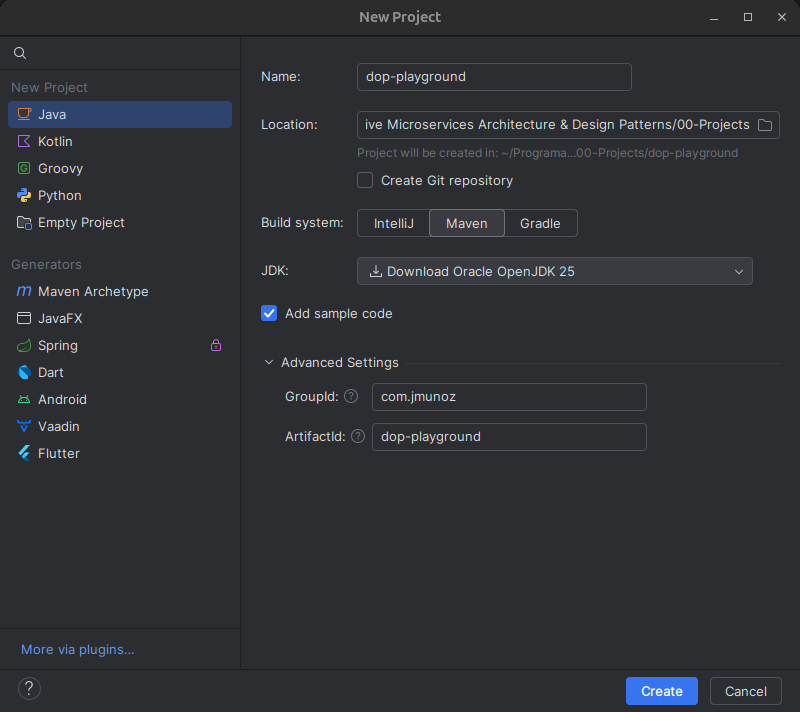

Al archivo `pom.xml` se le han añadido las siguientes properties, dependencies y build:

```xml
<properties>
    <logback.version>1.5.19</logback.version>
    <jackson.version>2.20.0</jackson.version>
</properties>

<dependencies>
    <!-- logging library -->
    <!-- https://www.baeldung.com/logback -->
    <dependency>
        <groupId>ch.qos.logback</groupId>
        <artifactId>logback-classic</artifactId>
        <version>${logback.version}</version>
    </dependency>
    <!-- To deserialize json into Java object or vice versa -->
    <dependency>
        <groupId>com.fasterxml.jackson.core</groupId>
        <artifactId>jackson-databind</artifactId>
        <version>${jackson.version}</version>
    </dependency>
</dependencies>

<build>
    <plugins>
        <plugin>
            <groupId>org.apache.maven.plugins</groupId>
            <artifactId>maven-compiler-plugin</artifactId>
            <configuration>
                <source>25</source>
                <target>25</target>
            </configuration>
        </plugin>
    </plugins>
</build>
```

En la carpeta `main/src/resources` se ha creado el archivo `logback.xml`, para formatear los logs, con el siguiente código:

```xml
<!-- http://dev.cs.ovgu.de/java/logback/manual/layouts.html -->
<configuration>
    <appender name="STDOUT" class="ch.qos.logback.core.ConsoleAppender">
        <encoder>
            <pattern>%d{HH:mm:ss.SSS} %-5level [%15.15t] %cyan(%-30.30logger{30}) : %m%n</pattern>
        </encoder>
    </appender>
    <root level="INFO">
        <appender-ref ref="STDOUT" />
    </root>
</configuration>
```

## Records

### How Records Work

Todos hemos escrito `Plain Old Java Objects` (POJO) como estos:

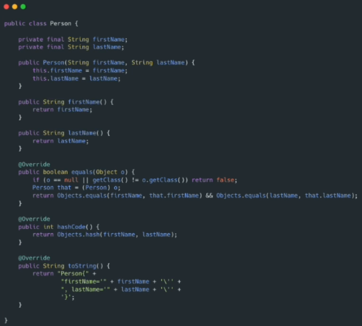

Para una clase `Person` como la que se ve en la imagen, necesitamos construir:

- constructor
- getters
- equals
- hashCode
- toString

Esta es una clase solo para mantener el nombre y el apellido de una persona, pero hay demasiado código involucrado.

Los `Records` de Java solucionan este inconveniente:

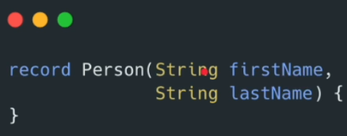

A partir de Java 17 se pueden crear `records` como este para modelar data.

Solo con este código obtenemos automáticamente todo el código que vimos en el POJO (constructors, getters...), sin necesidad de `Lombok`.

Los `records` no dejan de ser clases y, cuando se compilan, se puede ver que autogeneran constructores, toString, getters...:

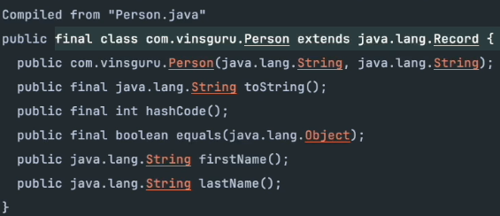

Vemos que los getters no anteponen `get` al nombre. No es `getFirstName()` sino `firstName()`. Esto es porque no hay setters, por lo que no hay que diferenciar entre ellos.

Por tanto:

- Cada record extiende de `java.lang.Record`.
- `Record classes` no pueden extender de otras clases / records.
- Los `Records` son final. Ninguna otra clase puede hacer `extends` de un record.
- Los `Records` no tienen métodos setter.
- Los `Records` están destinados a ser portadores de datos.
- La compilación genera automáticamente lo siguiente:
  - Un constructor.
  - Métodos equals/tostring/hashCode
  - Métodos getter (con exactamente los mismos nombres que los campos)
- Los campos de un `record` se llaman `record components`.
- Se convierten en campos `private final` de la clase compilada.
- `Records` extienden indirectamente de `java.lang.Object`.
  - Person -> java.lang.Record -> java.lang.Object

### Record Equality

En `src/java/com/jmunoz/sec01` creamos las clases siguientes:

- `Lec01RecordBasicsDemo`: Creamos un record dentro de esta clase y exploramos lo básico de los records, como getters, equals, toString...

### Canonical Constructor

En `src/java/com/jmunoz/sec01` creamos las clases siguientes:

- `Lec02CanonicalConstructor`: Ejemplo del constructor autogenerado por defecto, llamado Canonical Constructor y el problema que conlleva si el record tiene muchos campos.

### Compact Constructor

Durante esta clase, vemos que no podemos acceder a `this` en el compact constructor (si en el canonical constructor).


De nuevo, cuando creamos un `record` como el de la parte izquierda de la imagen, el canonical constructor con todos los campos es generado automáticamente por el compilador (normalmente no tenemos que escribirlo nosotros).


Pero, a veces, sí que tenemos que escribir nosotros el canonical constructor, si queremos modificar un valor antes de almacenarlo, como en este caso donde el apellido es transformado a mayúsculas.


Con el compact constructor, aunque su nombre indica la palabra constructor, no es realmente un constructor si no, más bien, una pista que compartimos con el compilador.

Es decir, seguimos queriendo que el compilador genere el código, pero le estamos diciendo al compilador que, cuando asigne los campos, lo haga de la manera que le pedimos.


El compilador acaba creando un constructor como el que se ve en la imagen de arriba, y no podemos usar `this` por eso, porque queremos que el compilador nos genere la parte de asignación de variables.

Si indicásemos `this.lastName = lastName.toUpperCase();` daría error porque el compilador hace después `this.lastName = lastName;` y, como `lastName` es, igual que todos los campos de un record, un `private final`, solo se puede inicializar una vez, con lo que obtenemos un error de compilación.

En `src/java/com/jmunoz/sec01` creamos las clases siguientes:

- `Lec03CompactConstructor`: Ejemplo con CompactConstructor, que arregla el problema de construir Canonical Constructor.

### Compact Constructor - Validation

Como el código del compact constructor se ejecuta primero, es perfecto para hacer validaciones.


En la imagen de arriba puede verse como se implementan las restricciones de negocio en el compact constructor.

También se puede usar la API de Jakarta Validation, con las anotaciones `@NotNull`, etc, pero hay que añadir dependencias externas. Esto lo veremos como parte del proyecto que haremos en Spring Boot.

Por tanto:

- Se recomienda usar Compact Constructor.
- Existe particularmente para añadir la lógica de validación y/o la lógica de procesamiento antes de inicializar los campos.

En `src/java/com/jmunoz/sec01` modificamos la clase siguiente:

- `Lec03CompactConstructor`: Añadimos validaciones.

### Non-Canonical Constructor

Non-canonical constructor es un constructor con una firma diferente a la de los componentes del record.

El caso de uso es el siguiente: Tenemos uno de los campos del record que podría tener un valor por defecto, como el campo `LocalDate createdAt`, pero estamos obligados, al crear una instancia, a darle un valor.

Nos gustaría no tener que indicar ese valor, y asumir que, si no lo enviamos, va a ser el día actual. Aquí es donde Non-canonical constructor es útil.

En `src/java/com/jmunoz/sec01` creamos las clases siguientes:

- `Lec04NonCanonicalConstructor`: Ejemplo para crear firmas diferentes a la de los componentes del record.

### Are Records Inmutable?

Un objeto inmutable es un objeto que, una vez construido, no puede modificarse. Si necesitamos algo diferente, necesitaremos crear otro objeto.

Los `Records` Java son **superficialmente inmutables**, lo que significa que depende.

Los componentes `Record` son final, pero eso solo NO garantiza la inmutabilidad.

**Un `Record` es verdaderamente inmutable solo si todos sus componentes son inmutables.**

En `src/java/com/jmunoz/sec01` creamos las clases siguientes:

- `Lec05ImmutableRecord`: Ejemplos de inmutabilidad (no lo es al 100%) de los records.

### Accessor Method Override

Cuando creamos un record con sus componentes, por defecto crea métodos getter para cada componente. A esos getter se les llama `Accessor Methods`.

Y se pueden sobreescribir, pero no deberíamos cambiar la firma del método.

En `src/java/com/jmunoz/sec01` creamos las clases siguientes:

- `Lec06AccessorMethodOverride`: Ejemplos de sobre-escritura del funcionamiento de los métodos getter de los `Records`.

### Nullable Fields

Los `records` son portadores de datos, y sus campos pueden ser null.

Si necesitamos evitar que sean null, usaremos un `compact constructor` para validar los campos, o usaremos `Optional` para hacerlo más explícito.

En `src/java/com/jmunoz/sec01` creamos las clases siguientes:

- `Lec07NullableFields`: Vemos diferentes formas de tratar con campos de un `record` que pueden ser nulos.

### No Extra Instance Fields

Imaginemos un `Record` como este:


¿Podemos colar un campo extra en este `record`?


No, esto no funciona, no podemos añadir campos `private` de instancia extra. Todo lo que pertenece al `record` debe declararse como un componente del `record` (donde están firstName y lastName).

Esto está diseñado así para mantener los `records` simples, predecibles y centrados en la data que tienen que transportar.

Lo que sí se puede hacer es añadir un método de instancia de esta forma:


### Static Members

Vamos a hablar de miembros estáticos en `records`.

En la clase anterior dijimos que un `record` no puede tener miembros de instancia `private`, pero sí que podemos tener miembros `static` y métodos factory estáticos.

En `src/java/com/jmunoz/sec01` creamos las clases siguientes:

- `Lec08StaticMembers`: Ejemplos de miembros estáticos y métodos de factoría estáticos.

### Records Implementing Interface

Los `records` no pueden extender clases, ¡pero pueden implementar interfaces!

En `src/java/com/jmunoz/sec01` creamos las clases siguientes:

- `Lec09RecordInterface`: Ejemplo de un `record` implementando una interface.

### Reflection

Recordar que los `records` son clases compactas que transportan datos y conocemos los tipos de los componentes de un `record` en tiempo de compilación.

Hay escenarios, especialmente en frameworks, librerías o tools donde necesitamos hacer instrospección o acceder a componentes de un `record` dinámicamente.

Esto no es algo que necesitemos hacer diariamente, normalmente es útil en la creación de librerías.

- Por ejemplo:
  - Si la clase dada es un `record`.
  - Si es que sí, listar todos los componentes de un `record` y sus tipos.

En `src/java/com/jmunoz/sec01` creamos las clases siguientes:

- `Lec10RecordReflection`: Ejemplos de uso de reflexión.

### Organizing Records

Vamos a ver como organizar `records` en un producto relativamente grande.

Ya hemos indicado más de una vez que los `records` son clases compactas que almacenan data, y podemos tener muchísimos `records` pequeños en nuestro proyecto.

¿Cómo los mantenemos organizados? ¿Y, donde? Indicar que lo que se diga en esta clase son solo ideas, y unas no serán siempre mejores que otras. Hay que ser flexibles y usar un enfoque híbrido.

**Opción 1: Ficheros separados**


Es la opción más obvia, crear `records` en ficheros Java separados. Las más de las veces, es lo que haremos.

Es útil cuando ciertos tipos se reutilizan en varios sitios. Por ejemplo, en la imagen tenemos el `record` Address, que se usa como parte de otros `records`.

La estructura de paquetes podría ser esta:

- Tendremos un package `model`.
  - Address.java
  - User.java
  - Business.java
  - etc.
- Se pueden crear muchos packages para mantenerlo todo organizado.

- Los componentes son reutilizables.
- Usar si el proyecto necesita modularidad.
- Es fácil de probar y mantener.

**Opción 2: Clases Orientadas a Feature/Domain**

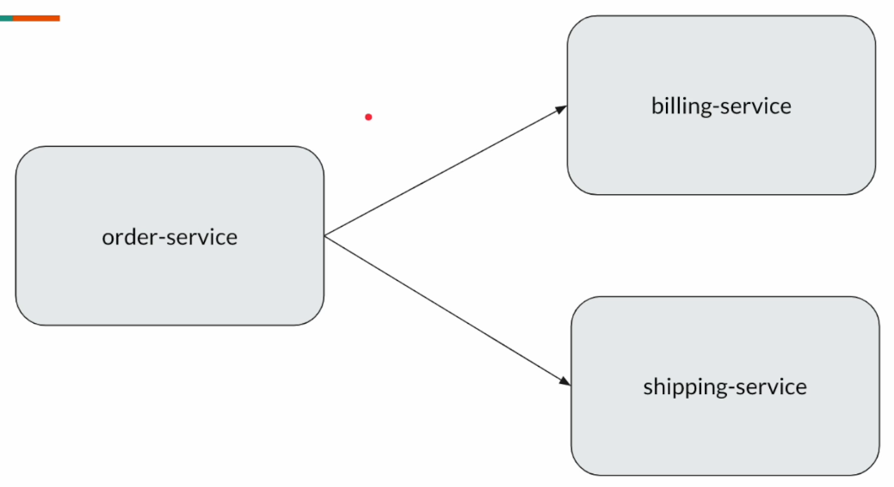

Imaginemos esta arquitectura de microservicios. Nosotros somos los desarrolladores de `order-service` y necesitamos llamar a los otros dos servicios.

Podemos tener los `DTO` para la petición y la respuesta de ambos servicios.


Podemos agrupar todos los models de `records` en clases de feature específico, o servicio específico o dominio específico.

Abajo de la imagen puede verse como se crea una instancia de Invoice.

La estructura de paquetes podría ser esta:

- 'model'
  - BillingDomain.java
  - ShippingDomain.java
  - etc.

**Opción 3: Records anidados - Fuertemente acoplados**

Es similar a la opción 2.


Consideremos este JSON, que puede ser una respuesta de un `movie service` que viene de `GraphQL`.

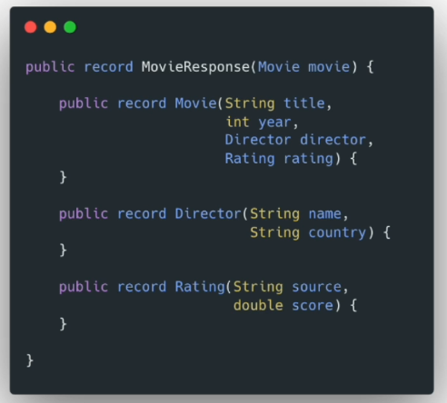

Para deserializar este JSON en un Java Object podemos usar `records` como los de la imagen, anidados. ¿Por qué lo hacemos así?

- Los modelos son específicos de un caso de uso en particular.
  - No se va a reutilizar, digamos, el `record` Director.
- Están logicamente conectados a la estructura padre, MovieResponse en este caso.
- Encapsulación - Oculta helper types que NO son necesarios fuera.

**Opción 4: Records anidados privados (Helper)**


Estos `records` son normalmente `helper records`, solo para comunicaciones entre métodos localizados dentro de una clase.

No son accesibles desde fuera de la clase, ya que son `private`.

**Opción 5: Records locales (Helper)**


Al igual que tenemos `records` a nivel de clase, también podemos tener un `record` local a nivel de método, accesible solo dentro del método.

En el código de la imagen, vemos que realmente no haría falta el `record`, pero en la vida real, podríamos tener un requerimiento complejo, y, en esos casos, podríamos querer guardar temporalmente la información, con lo que un `record` estaría muy bien justificado.

De todas formas, indicar que crear un `record` local no es algo muy común.

Cuando este código se compile, el compilador verá esta definición de `record` y creará una clase para ese `record` y, al ejecutar esta aplicación, el `class Loader` lo cargará solo una vez, al igual que haría con cualquier otra clase.

Por tanto, `class Loader` no va a cargar esa clase cada vez que se llame al método.

### Summary

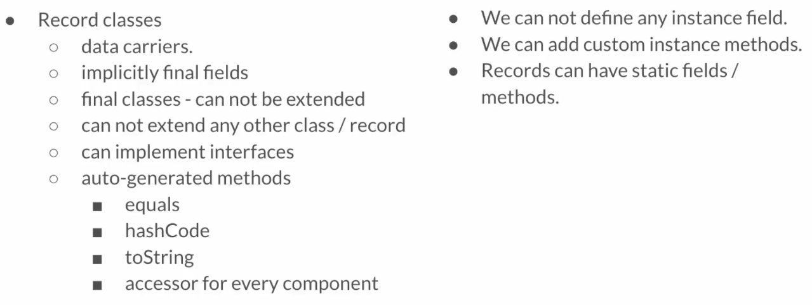

- Dos instancias de un `record` son iguales **solo si** todos sus componentes son iguales.
  - Se debe usar el método `equals`.
- Un `record` es verdaderamente inmutable **solo si** todos sus componentes son inmutables.


- Hemos visto varias formas de organizar los `records` Java.
  - Separate Files: Crear un fichero Java separado por `record`.
    - Mejor para estructuras de datos reutilizables entre distintos módulos o servicios.
  - Feature/Domain Oriented Classes
    - Ayuda a estructurar el código en contextos delimitados o dominios de microservicios.
  - Nested Records - Tightly Coupled
    - Ideales para respuestas API estructuradas o models encapsulados.
  - Private Inner Records (Helper)
    - Útil para comunicación local entre métodos dentro de una clase.
  - Local Records (Helper)
    - Pueden ser útiles en stream pipelines.

## Sealed Types

### Need For Sealed Types

`Sealed` es un modificador que se introdujo en Java 17, y que es usado para controlar la jerarquía de clases.

Tener en cuenta que:

- En esta sección, vamos a comprender "qué" es, y "como" funciona el modificador `sealed`.
- Pero "por qué / dónde deberíamos usarlo" puede no quedar claro.
  - Esto quedará claro más tarde, conforme el curso avance, porque todo el curso va a ir sobre esto.
  - Cuando veamos más ejemplos (tras cubrir `pattern matching`) se entenderá mejor, ya que están muy relacionados.

Los programadores Java ya conocemos la `abstracción`, que conseguimos mediante: 

- Clases Abstractas
- Interfaces

Todas nuestras aplicaciones, desde siempre, han sido diseñadas de esta forma.

Ahora surge el keyword o modifier `sealed`. ¿Para qué lo necesitamos? ¿Por qué queremos restringir o controlar la jerarquía de clases? En definitiva, ¿qué problema estamos resolviendo?


Imaginemos esta clase abstracta `Car`. Tenemos dos posibles implementaciones, `Honda` y `Toyota`, así que las creamos extendiendo la clase abstracta `Car`.

El problema es que no solo `Honda` y `Toyota` pueden extender `Car`. Cualquier clase puede extender de `Car`, como `Toy`.


El problema es que esto puede llevar a sorpresas en tiempo de ejecución, a comportamientos inesperados.


En este ejemplo, vemos que si se pasa una lista no modificable, al ejecutar el método `add()`, dará un error en tiempo de ejecución.

La primera llamada al método si la detecta el compilador, pero la segunda no.

Lo que queremos es un `comportamiento predecible` de nuestra aplicación, que salten todos los problemas en tiempo de compilación.

Si volvemos al ejemplo de la clase abstracta `Car`, si añadimos el modificador `sealed`, no nos va a permitir que ninguna otra clase que no queramos extienda `Car`.


Añadiendo el modificador `sealed` y las clases que permitimos que extiendan `Car`, el mismo compilador no va a permitir que `Toy` extienda `Car`.

¿Qué pasa si `Toy` extiende de `Honda` o de `Toyota`? ¡No puede! Al usarse `sealed`, `Honda` y `Toyota` tienen que usar uno de estos modificadores:

- final
- sealed
- non-sealed

Estos modificadores impedirán que una clase extienda de algo que no queramos.

En este otro ejemplo, vemos como controlar la jerarquía de clases usando `sealed` también en `Honda`.

- **Es muy importante indicar que todas las clases `sealed` y `permits` tienen que estar en el mismo package.**
- Esto es por diseño, para restringir la jerarquía.
  - El contrato `sealed` (sellado) tiene que aplicarse en **tiempo de compilación**.
- Es un **control estricto**.
  - Es intencional para asegurar **comportamiento predictivo**.
  - Las clases `sealed` y las subclases `permits` **evolucionan juntas** conforme cambian los requerimientos.


Cuando usamos el modificador `non-sealed` obtenemos el comportamiento tradicional, es decir, a partir de indicar `non-sealed` ya no se controla la jerarquía.

Es decir, si indicamos `non-sealed Toyota`, cualquier clase podrá extenderla.


Restringir la jerarquía nos va a ayudar a implementar nuestras reglas de negocio de una forma mucho más limpia.

Intentaremos capturar todos los problemas por adelantado, en tiempo de compilación, reduciendo los problemas en tiempo de compilación.

Esto lo veremos conforme vayan avanzando las secciones del curso.

### Sealed Type Demo 1

Vamos a jugar con el modificador `sealed` codificando este diseño:


Imaginemos que nuestra aplicación soporta solo dos tipos de `Payment`, `Cash` o `CreditCard`.

Como se muestra en la imagen, el objetivo de esta clase es ver como funcionan las keywords `seales`, `permits`, etc.

En `src/java/com/jmunoz/sec02` creamos los paquetes/clases siguientes:

- `lec01`
  - `Payment`: Clase abstracta que usa `sealed`.
  - `Cash`: Clase sealed que es permitida que extienda de `Payment` y permite que `CashRewards` la extienda.
  - `CreditCard`: Clase final que es permitida que extienda de `Payment`.
  - `Demo`: Clase que utiliza nuestra jerarquía de clases creadas anteriormente.

Recordar que tanto `Cash` como `CreditCard` tienen que estar en el mismo package que `Payment`.

### Sealed Type Demo 2

Como parte del nuevo requerimiento de negocio, tenemos unos clientes leales que, cuando usen `Cash` obtendrán `CashRewards`, un punto por cada dólar gastado.

En `src/java/com/jmunoz/sec02` creamos las clases siguientes:

- `lec01`
  - `CashRewards`: Clase final que es permitida que extienda de `Cash`.

### Sealed Interface With Records

En esta clase, en vez de usar una clase abstracta, vamos a usar una interface y, como los `records` puede implementar interfaces, tanto `Paypal` como `CreditCard` serán `records` en vez de clases.


En `src/java/com/jmunoz/sec02` creamos los paquetes/clases siguientes:

- `lec02`
  - `Payment`: Interface que usa `sealed`.
  - `CreditCard`: Records que es permitido que implemente de `Payment`. 
  - `Paypal`: Records que es permitido que implemente de `Payment`. 
  - `Demo`: Clase que utiliza nuestra jerarquía de clases creadas anteriormente.

### (Clarification) - Records With Side Effects!!


Hemos dicho que los `records` son portadores de datos, solo mantienen data y deberíamos intentar mantenerlos inmutables.

En la imagen, el método process tiene efectos secundarios, ya que no devuelve nada.

Este método no es una buena práctica y, en la vida real, no lo implementaríamos así, como un `record` que implementa la lógica de procesamiento del pago.

Esto es solo un pequeño ejemplo para demostrar el modificador `sealed`.

### Summary

El modificador `sealed` sirve para restringir la jerarquía de clases.

A lo largo del curso veremos sus casos de uso reales porque, de hecho, los conceptos de la `data oriented programming` dependen mucho de `sealed`.

Las palabras clave de esta sección son `sealed`, `final`, `non-sealed` y `permits`, y recordar que toda la jerarquía de clases debe codificarse en el mismo package.

## Pattern Matching

- `Pattern matching` nos permite comprobar si un objeto es de un tipo específico o tiene una cierta estructura, y luego extrae data de él - ¡todo en un paso!
  - Test & Unpack

### Is instanceof Bad?

`Pattern matching` puede lograrse en Java usando:

- instanceof
  - Vamos a hablar de él en esta clase.
- Expresión switch
  - Esto es lo que estaremos viendo mayormente en el curso, ya que se obtiene un código más fácil de leer.

Ver la siguiente imagen:


`instanceof` es considerado un `code smell` si la lógica puede manejarse más limpiamente a través de llamadas a métodos polimórficos.

Ver ahora esta imagen:

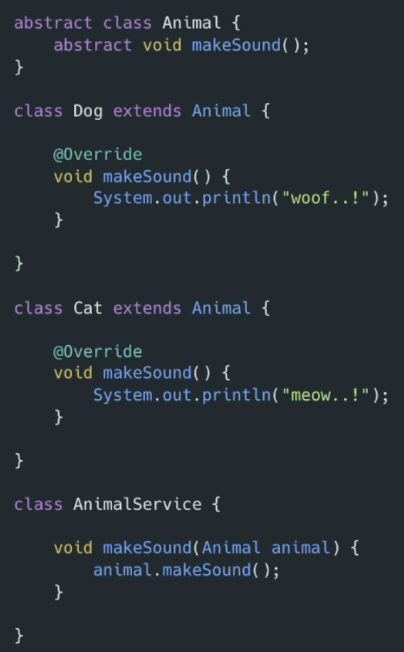

Idealmente, así es como debería implementarse el ejemplo anterior, usando polimorfismo.

El supuesto básico es que tenemos acceso al código (somos los dueños de estos tipos) y podemos modificarlo. En este caso, `instanceof` puede ser mala práctica, pero en otros casos se considera buena práctica.

Cuando es buena práctica el uso de `instanceof`:

- Tratamos con tipos que no comparten una abstracción común (como String, List, Map, etc.)
- No controlamos el código fuente.
- Escribimos utilidades como `isEmpty`, `deepCopy`, etc.
- Intentamos conectar bibliotecas externas
  - Spring Framework


### Pattern Matching - instanceof

Antes de Java 16 así se usaba `instanceof`:


Primero comprobamos si el tipo dado es String y luego invocamos de forma segura el método String. Si no lo hacemos así el compilador se quejará.

En Java 16 el equipo de Java realizó una mejora menor:


Ahora podemos usar esta forma, donde la variable `string` se llama `pattern variable`. Cuando el objeto dado coincide con el tipo String, `pattern variable` se inicializa y ahora podemos acceder al objeto usando ese `pattern variable`.

`pattern matching` tiene más cosas interesantes que iremos viendo en esta sección.

El código con `instanceof` que vimos en la clase anterior puede hacerse más legible usando `pattern variable`.


Sin embargo, aunque la forma de la derecha es más legible, no tiene por qué ser mejor, ya que hay muchas condiciones `if - else`. Se ve feo.

En la próxima clase hablaremos de `switch expression`, con lo que el código será mucho más legible.

Algo muy importante a considerar es el ámbito de `pattern variable`:


Estudiar las imágenes para ver en qué bloque de código podemos acceder a `pattern variable`. Lo normal es usar el código tal y como se ve en la imagen de la izquierda.

En `src/java/com/jmunoz/sec03` creamos las clases siguientes:

- `Lec01InstanceOf`: Ejemplo de uso de `instanceof` usando `pattern variable`.

### Switch Expression

Las `switch expression` no son lo mismo que las `switch statement` tradicionales. Estas últimas tienen los siguientes problemas:

- Necesitamos usar `break` en cada `case` para salir del switch.
  - En la imagen de abajo, la falta de `break` en `case "US"`, hace que el valor taxRate sea `0.06` en vez de `0.05`.
- Tenemos que declarar una variable y asignarle un valor dentro de cada `case`.
  - Repetitivo.
- Es una sentencia, no una expresión.


Vamos a implementar los mismos requerimientos usando la moderna `switch expression` para ver como funciona.

En `src/java/com/jmunoz/sec03` creamos las clases siguientes:

- `Lec02SwitchExpression`: Ejemplo de uso de `switch expression`.

### Type Pattern

Veamos de nuevo este código que usa `instanceof` y `pattern variable`:


Con tantos condicionales `if-else` no es muy legible.

Veamos como podemos reescribirlo usando `switch`:

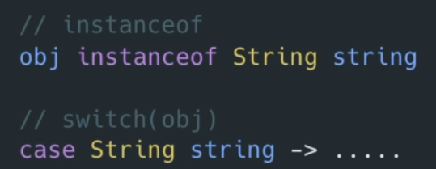

En la parte superior de la imagen vemos lo que hacemos cuando usamos `instanceof` como parte de `type pattern matching`. Se usa `string` como `pattern variable`.

En la parte inferior de la imagen vemos lo que hacemos cuando usamos `switch expression`. El `switch` contendrá el objeto y se comprobará en el `case` que el objeto dado es instancia de String. Si es el caso, se usará el `pattern variable` `string` tras la flecha.

En `src/java/com/jmunoz/sec03` creamos las clases siguientes:

- `Lec03TypePattern`: Ejemplo de uso de `switch expression` con `type pattern`. Queda un código muy legible si lo comparamos con `Lec01InstanceOf`.

### Pattern Label Dominance

¿Qué ocurre cuando varios `pattern labels` (los case) satisfacen la condición para un objeto dado en un `switch`? Solo se ejecuta un bloque.


En `src/java/com/jmunoz/sec03` creamos las clases siguientes:

- `Lec04PatternLabelDominance`: Vemos que `case` se ejecuta cuando más de uno cumple la condición. 

### Guarded Pattern Label


En la imagen vemos el `pattern label` (case Integer i), y, a su lado, podemos tener una expresión booleana (when ...). Si el case y la condición booleana se cumplen, se ejecutará el bloque de código.

El nombre viene de: El `pattern label` es `guarded` por la clausula `when`.

En `src/java/com/jmunoz/sec03` creamos las clases siguientes:

- `Lec05GuardedPattern`: Vemos como funciona una cláusula guarda en un `pattern label`. 

### Unnamed Variable

A veces, nuestros requerimientos serán recibir un objeto y comprobar si es de tipo Double o Integer, etc.

Pero no necesitamos realmente el valor porque con que coincida el tipo es suficiente para hacer algo, pero el valor nos da igual.

Podemos usar el guion bajo para indicar que no queremos el `pattern variable` de esta forma: `case Double _ -> log.info("received double");`.

En `src/java/com/jmunoz/sec03` creamos las clases siguientes:

- `Lec06UnnamedVariable`: Vemos como trabajar con `pattern matching` cuando solo nos interesa el tipo, pero no necesitamos el valor.

### Record Pattern


Imaginemos que hemos definido un `record` genérico llamado `ApiResponse` que nos valga para obtener las respuestas de diferentes llamadas a microservicios, o un error tipo `BadRequest`, `InternalServerError`, etc.

Como se indica en el comentario, hay mejores formas de modelar ese record y lo veremos más adelante. Se hace así para este ejemplo.

Cuando en la parte inferior de la imagen usamos `switch expression` para `pattern matching`, si comprobamos si el objeto dado es del tipo `record` `ApiResponse`, podemos deconstruir el `record` y comprobar los `record components`.

En el ejemplo concreto indicamos que `success` es un `pattern variable` de tipo `Integer` y que no nos interesa el error (`unnamed varible`) porque estamos obteniendo un tipo de respuesta exitosa.

En `src/java/com/jmunoz/sec03` creamos las clases siguientes:

- `Lec07RecordPattern`: Vemos un ejemplo de `record pattern`.

### Nested Record Pattern

En `src/java/com/jmunoz/sec03` creamos las clases siguientes:

- `Lec08NestedRecordPattern`: Vemos un ejemplo de `record pattern` anidados.

### Switch Exhaustiveness

Cuando usamos `switch` nos obliga a añadir el bloque `default`, porque piensa que no hemos cubierto todos los posibles valores de entrada.

Pero en algunos casos sí que podemos cubrir todos los posibles valores de entrada y, en ese caso, no hace falta que usemos `default`.

En `src/java/com/jmunoz/sec03` creamos las clases siguientes:

- `Lec09Exhaustiveness`: Vemos que no es necesario indicar el caso `default` si se cubren todos los posibles valores de entrada.

### Summary

- `Pattern matching` nos permite comprobar si un objeto es de un tipo específico o tiene cierta estructura, y extraer su data.
- `Pattern matching` puede conseguirse usando:
  - `instanceof`
    - La nueva forma nos permite obtener un `pattern variable`.
  - `switch expression`
    - Más legible que usar `instanceof` con muchas condiciones `if-else`.
    - Mejor que el `switch` clásico, sin sentencia `break`.
    - Permite usar cláusulas guarda para comprobar condiciones.
    - Si el tipo es un `record` o un `record component`, se puede deconstruir.

## Principles Of Data Oriented Programming

### Introduction To Data Oriented Programming

- Es un enfoque de programación donde la data y las acciones (comportamiento) que operan sobre esa data están agrupados en objetos.
  - Muy adecuado donde la data y el comportamiento correspondiente están fuertemente acoplados.
  - Cuando los objetos necesitan gestionar su propio estado.
  - En estructuras de datos en memoria como List/Set/Map, etc.

La programación orientada a objetos encaja naturalmente con aplicaciones monolíticas donde todos los módulos de la aplicación, como el módulo `customer`, el módulo `payment`, el módulo `order`, etc. viven juntos. Era fácil modelar las complejas entidades de negocio como objetos que agrupaban tanto data como comportamiento. Los módulos pueden interactuar unos con otros pasándose objetos.

Pero la arquitectura de una aplicación moderna ha cambiado. Se construyen aplicaciones como una colección de microservicios. Estos servicios se comunican por la red intercambiando data plana, típicamente en formato JSON, protobuf, o formatos similares.

En esta nueva arquitectura, no se pasan objetos con comportamiento. Se pasan solo datos sin procesar (raw data). La lógica que sabe como manejar esta data vive en cada microservicio.

Por tanto:

- La programación orientada a la data es un estilo de programación orientado a separar la data (usando estructuras simples, inmutables) del comportamiento que opera sobre esa data.

Java ha comenzado a soportar este tipo de programación gracias a características modernas como `records`, `sealed types` y `pattern matching`.

**OOP vs DOP**

- En OOP, modelamos objetos del mundo real que manejan su propio comportamiento.
  - Ej: `car.start();` donde car es un objeto que sabe como arrancar.
- En DOP, tratamos la data como data plana. No tiene comportamiento.
  - Piensa en tus clases de datos como hechos simples sobre el mundo.
  - La lógica que procesa estos hechos vive en otro sitio.
  - Ej: `record Car(String make, String model) {}` donde car es solo data sin comportamiento.

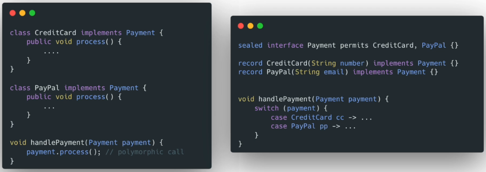

En la parte izquierda de la imagen vemos código OOP. Tanto `CreditCard` como `Paypal` implementan el método `process()` y, dependiendo de la instancia de `Payment` que pasemos, se invocará el comportamiento apropiado (polimorfismo).

En la parte derecha de la imagen vemos código DOP. Tenemos `records` que contendrán la información de `CreditCard`, `Paypal`, etc. Usando `pattern matching`, procesaremos `payment`.

En OOP, la lógica está dispersa en varios objetos y cada type conoce como procesar lo suyo.

En DOP, la lógica está centralizada y se comporta basada en el type.

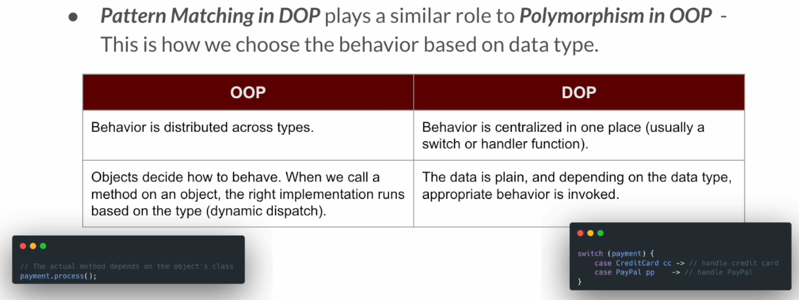

**Beneficios de usar DOP**

- Código legible y mantenible.
- Comportamiento más predecible.
- Fuerte soporte para compiladores que detectan errores de forma temprana, reduciendo las sorpresas en tiempo de ejecución.

**Notas**

- DOP no sustituye a OOP.
- Usar DOP cuando:
  - Tratamos con data inmutable como events, commands, messages, etc.
  - El modelo de negocio implica un flujo de trabajo complejo, con un conjunto de pasos a realizar en un orden particular.
    - Como cumplimiento de pedidos de comercio electrónico que incluye los pasos: detección del pago, inventario, planificación, envío, etc.
    - Como aprobación de un préstamo, etc.
  - Pasamos data entre componentes/servicios.
  - La lógica necesita estar centralizada y predecible en vez de distribuida entre objetos.

### Algebraic Data Types

Tipos de datos algebráicos es un nombre elegante para Programación Funcional.

- Tipos de datos compuestos - ¡tipos nuevos formados al combinar otros tipos!
  - Depende de como los combinemos, podemos clasificarlos en dos categorías:
    - AND / Product
      - Tipos de productos AND o Product.
      - Product significa combinación de valores que vienen de la teoría de conjuntos (Set) matemáticos.
    - OR / Sum / Choice
      - Tipos de productos OR o Sum o Choice.

- Tipos AND o Product: son `records`.
  - En el código de abajo vemos que el tipo Address se representa con una `street` AND un `city` AND un `zipCode`.
  - El tipo Customer se representa con `name` AND `email` AND `address`.

```java
record Address(String street, String city, String zipCode) { }

record Customer(String name, String email, Address address) { }
```

- Tipos OR / Sum / Choice: son `sealed types`.
  - En el código de abajo, Payment es un tipo con dos opciones posibles, `CreditCard` OR `Paypal`.

```java
sealed interface Payment permits CreditCard, Paypal { }

record CreditCard(String number, String cvv) implements Payment { }

record Paypal(String email) implements Payment { }
```

Ejemplos donde podemos usar `seales types`:


Todos estos ejemplos representan `Choice` entre distintas opciones.

Esto es importante porque en nuestro dominio de negocio tendremos muchos tipos OR, y tenemos que reconocerlos apropiadamente para poder modelar correctamente nuestro dominio de negocio.

En este código: `record PassengerMeal(Dring drink, MainCourse mainCourse) { }` vemos que el `record` contiene `drink` AND `mainCourse`.

Tenemos dos `Choice` para `drink` y tres `Choice` para `mainCourse`. En total, podemos crear seis combinaciones. Por esto lo llamamos tipo `Product`.

### Sealed Record - Pattern Matching - Demo 1

En `src/java/com/jmunoz/sec04` creamos los packages/clases siguientes:

- `lec01`
  - `Payment`: Es un `sealed interface` que contiene internamente dos `records` con los tipos de pago permitidos.
  - `Demo`: Clase principal.

### Sealed Record - Pattern Matching - Demo 2

Es otro ejemplo más de `seales records` y `pattern matching`.

En `src/java/com/jmunoz/sec04` creamos los packages/clases siguientes:

- `lec02`
  - `ContactType`: Es un `sealed interface` que contiene internamente dos `records` con los tipos de contacto permitidos.
  - `User`: Es un `record` con un campo de tipo `ContactType`.
  - `LoginVerificationService`: Clase que, en función del tipo de contacto, envía un código de login de una u otra forma.
  - `Demo`: Clase principal.

### Enum vs Sealed

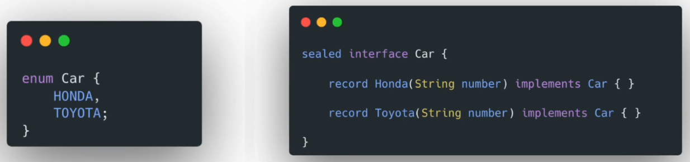

Este `enum` y este `sealed type` son parecidos cuando usamos el `sealed type` con `records`. ¿Por qué necesitamos `seales types` cuando ya tenemos `enum`?

La diferencia básica es esta:

- `Enum` es una clase que ya contiene las posibles instancias, en este caso 2, HONDA y TOYOTA.
  - Instancias restringidas.
- `Sealed Type` tiene dos posibles tipos, en este caso 2, Honda y Toyota.
  - Tipos restringidos, pero podemos crear millones de instancias (instancias NO restringidas).

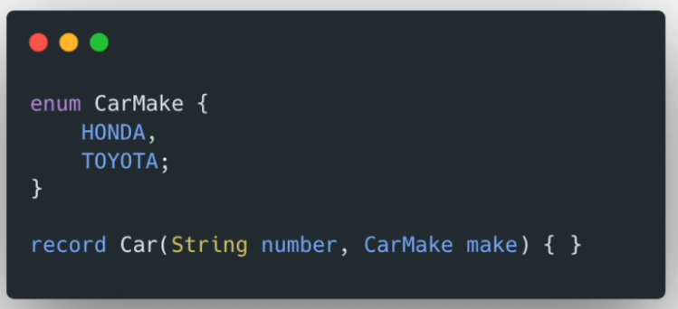

Pero, ¿por qué necesitamos `sealed types`? ¿No podemos crear algo como muestra la imagen? CarMake es un `enum` y creamos un `record` Car.

Se puede. De hecho, hemos creado millones de aplicaciones así.

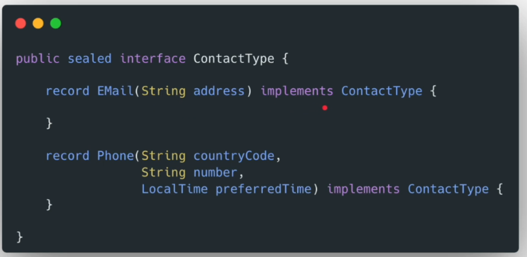

Pero en algunos casos, podemos tener propiedades adicionales.

En este ContactType, en caso de EMail, necesitamos la dirección de email. Pero en caso de Phone, necesitamos el código de país, el número de teléfono y la hora preferida.

Es decir, tenemos propiedades adicionales dependiendo del tipo de contacto, y en este caso no usaremos `enum`.

### Data Oriented Programming Principles

Al igual que en la programación orientada a objetos (POO) tenemos como principios fundamentales:

- Abstracción
- Encapsulación
- Herencia
- Polimorfismo

Los principios fundamentales de la programación orientada a la data (DOP) son:

- Datos del modelo como datos
- Hacer la data inmutable
- Validar en el límite
- Hacer que los estados ilegales sean irrepresentables

**Model Data As Data**

- Tratar la data como hechos sobre el mundo, no como objetos que saben qué hacer (no comportamiento).
- Definir los conceptos de negocio usando data bien estructurada.
  - record
  - sealed (para selección de tipos)

Ejemplos: 

- Product es un `record` con información básica sobre el producto. No posee métodos como `updatePrice()`...
- Customer tiene información sobre el nombre, email, pero no tiene métodos como `sendEMail()`...

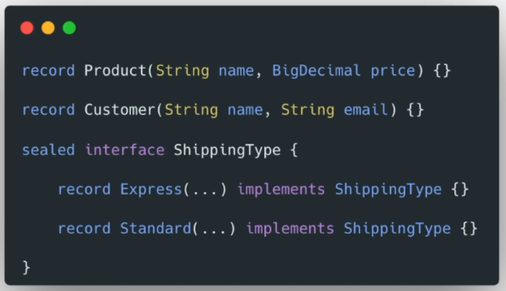

**Make Data Immutable**

- Una vez creada, la data NO debería cambiar. Esto lleva a comportamiento predecible y menos bugs.
- Un `record` con un campo mutable no modela data. Modela un estado variable en el tiempo.
  - Debemos asegurarnos que los componentes de los `record` son inmutables.

Ejemplos:

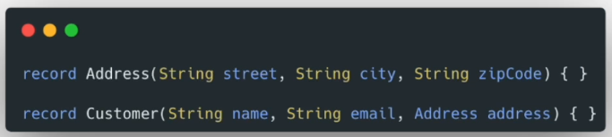

**Validate At The Boundary**

- Realizar la validación cuando la data entra en nuestro sistema (por ejemplo, peticiones HTTP, lecturas de BD), para que la lógica interna trate solo con data válida y fiable.
  - Usar `compact constructors` en `record` Java es una de las mejores formas de implementar este principio.
  - También se puede usar Jakarta Validation si usamos Spring.

Ejemplo: 

- Usando un `compact constructor` para validar la data nos aseguramos que no puede crearse un email inválido.
- La imagen del aeropuerto es un símil, donde antes de hacer el check-in, el personal de seguridad se asegura que tenemos todo en orden. Una vez nos dejan pasar, ya se confía que estamos con todo en regla.

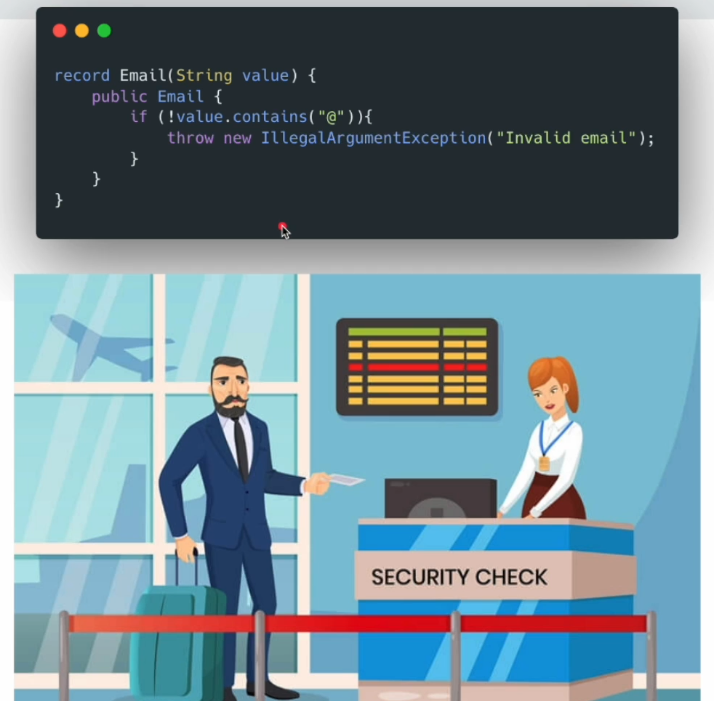

- También podemos recibir data desde el exterior, por ejemplo desde una petición, o leer de una BD, y no podemos confiar en esta data por defecto. De nuevo, tenemos que validar en los límites para asegurarnos que solo data válida y bien formada entra a nuestro sistema.
  - De esta forma, nuestro dominio principal queda limpio y puro, libre de estados inválidos o inconsistentes.

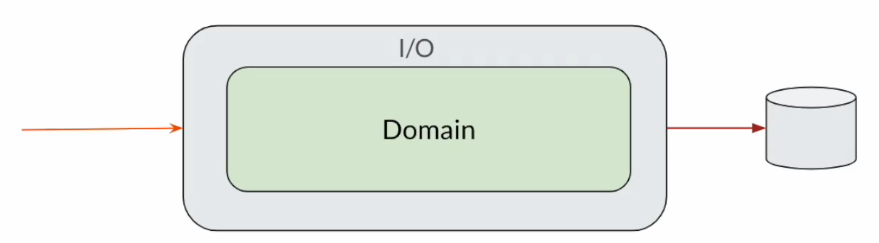

- Por último, vemos un ejemplo en que usamos Jakarta Validation. Suponemos que usamos Spring.

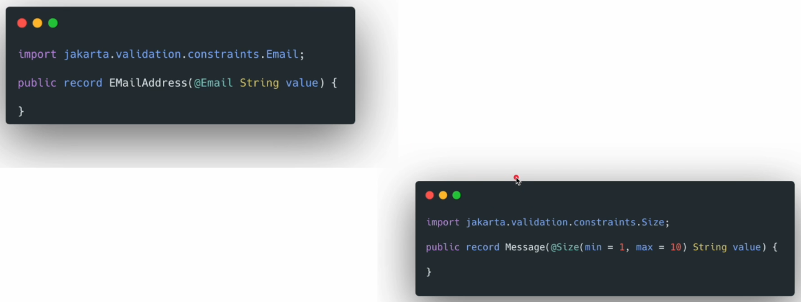

**Make Illegal States Unrepresentable**

- En vez de escribir mucho código para asegurarnos de que la data es válida, diseña tus estructuras de datos de tal forma que sea imposible crear estado malo o inconsistente.
  - Si el código no puede representar un estado inválido, evitamos validar en todos lados, y evitamos bugs debido a data errónea.
  - Nuestro código se vuelve más robusto y se explica por sí mismo.
- Beneficios:
  - `Seales types` garantizan que todos los posibles estados están explicitamente definidos, evitando formas de data inesperadas.
  - Comprobaciones en tiempo de compilación => `Pattern matching` con `switch` asegura que se manejan todos los estados, detectando errores en tiempo de compilación.

Ejemplo:

- TaskStatus solo puede tener los estados Todo, InProgress o Done. Cualquier otro tipo de estado dará un error en tiempo de compilación.

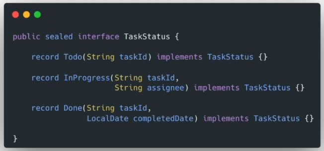

### Importance Of Types

Un código más seguro comienza con tipos más pequeños.

- Muchos desarrolladores dudan en crear tipos pequeños, enfocados.
  - Temen la llamada `class explosion`.
  - Usar primitivos/cadenas suele verse como más fácil para hacer el trabajo.
  - Definir nuevos tipos puede parecer excesivo.
- Pero en realidad, evitar los tipos adecuados lleva a:
  - Firmas de métodos confusos y ambiguos.
  - Parámetros que son fáciles de usar mal o intercambiarlos.
  - Lógica de validación frágil o repetida en todos lados.
  - Las reglas de dominio dispersas por todo el código fuente.

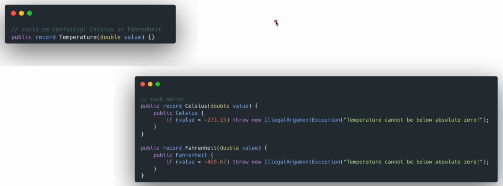

La programación orientada a la data prospera gracias a modelos de datos claros, estructurados e inmutables.

- Para comprender mejor estos conceptos, diseñaremos un sencillo servicio de email `EMailService` que acepta un `EMail` y un `Message` para enviar.
  - EMail debe tener un formato válido.
  - Message debe tener un mínimo de 10 caracteres y un máximo de 5000 caracteres.

En `src/java/com/jmunoz/sec04` creamos los packages/clases siguientes:

- `lec03`
  - `EMailService`: 
    - Desarrollo usando primitivos/cadenas en vez de tipos pequeños, pensando que así es más fácil el desarrollo.
    - Desarrollo usando records `EMailAddress` y `Message`.
  - `EMailAddress`: Record que modela un email válido.
  - `Message`: Record que modela un mensaje válido.
  - `Demo`: Clase principal.

### [Clarification] - Can Records Have Methods?

¡Separar la data del comportamiento NO significa que los `records` no puedan tener métodos!

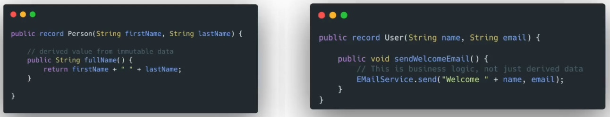

Métodos del tipo que aparecen en la imagen de la izquierda son perfectamente admisibles, ya que el método no tiene efectos secundarios.

Métodos del tipo que aparecen en la imagen de la derecha es mejor no hacerlos, ya que tienen efectos secundarios, porque son operaciones IO.

Si nuestros `records` empiezan a mandar emails, hablar con BD o gestionar flujos de datos, entonces ya no es solo data. El testing también va a ser más complicado porque, ¿cómo probamos este método sin hacer mock o configurar una infraestructura de email? Rompe la idea de que la data debe ser pura y predecible.

## Domain Modeling

### Introduction

`Domain Modeling` es un proceso de diseño de estructuras de datos que representan los conceptos clave en un dominio de negocio específico (e-commerce, banca, atención médica...)

- Identificamos entidades del mundo real (Customer, Order, Product...)
- Definimos relaciones entre ellas.
- Definimos estados válidos y transiciones.

Las ventajas que trae al software un buen modelaje son:

- Más fácil de leer.
- Más fácil de probar.
- Más fácil de extender.
- Más alineado con el lenguaje del negocio.

**Recognizing Patterns In Domain**

Todo comienza reconociendo patrones del dominio. Cuando vamos analizando y modelando un dominio, empezamos a ver patrones recurrentes.

Estos patrones nos ayudan a escribir código que es expresivo y confiable.

- Simple Values (Tienen significados específicos en el dominio)
  - No son solo Strings o números, tienen significado en el dominio y deben modelarse explícitamente.
  - EMail Address / Phone / Product Code / Price
- ADT - AND Types (combinación de values)
  - Address, Order, etc, donde Address está compuesto de street AND city AND zipCode.
- ADT - OR Types (elecciones)
  - Shipping puede ser Express OR Standard.
- Processes / Workflows
  - Representa como cambian las cosas en el tiempo, desde un estado válido a otro. 
  - Acciones que toman entradas, realizan transformaciones y producen salidas.
  - Cada transición puede tener precondiciones o reglas para acceder a la siguiente transición.
  - Pending -> Paid -> Shipped -> Delivered
  - Incluso esto puede modelarse usando el tipo OR (elecciones). Por ejemplo, un estado Order puede ser uno de los estados de arriba en un punto dado. Evitamos transiciones a estados inválidos y hace la lógica de negocio clara y auditable.

### Modeling State Change

En esta clase vamos a ver como modelar este cambio de estado en el flujo de nuestra aplicación.

- Tenemos estos 4 estados
  - Pending -> Paid -> Shipped -> Delivered
- En el futuro, podemos añadir estos estados adicionales
  - Refunded
  - Cancelled

**Avoid Boolean**

Muchos desarrolladores intentarán crear cláusulas guarda usando booleanos para cada posible estado.

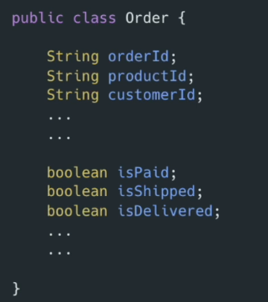

Estos booleanos pueden causar muchísima confusión, porque, ¿es esto posible?

- Paid = false, Shipped = true
- Paid = true, Shipped = false, Delivered = true

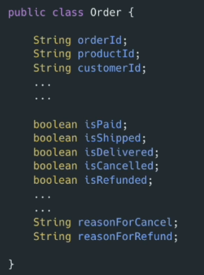

Si tenemos que añadir más estados, como Refunded o Cancelled, tendremos más booleanos como isCancelled o isRefunded. Esto creará todavía más confusión.

Puede que también existan campos String como reasonForCancel, aplicable solo cuando isCancelled es true, o reasonForRefund aplicable solo cuando isRefunded es true. Si valen false, el valor de estos String será null.

Esto no es un buen diseño. Tenemos que evitar usar booleanos para gestionar estados.

**Enum Is OK!**

Comparado con booleanos, usar Enum para los estados es correcto.

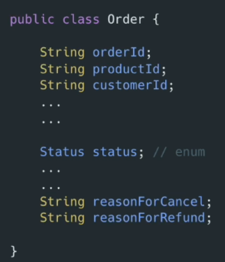

Sin embargo, tenemos el mismo problema con los campos reasonForCancel y reasonForRefund. Dependiendo del estado accederemos a un campo o a otro.

Esto ya lo vimos cuando discutimos la diferencia entre Enum y tipos Field.

**Explicit Type Is Perfect!**

Usar tipos explícitos es un enfoque mucho mejor, más limpio.

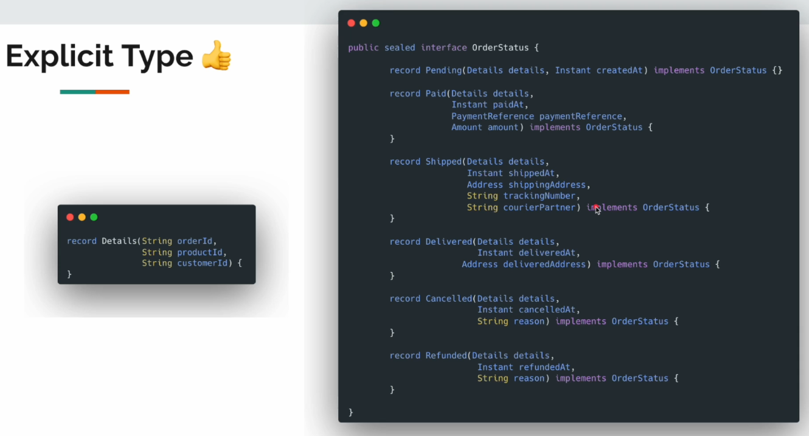

Tenemos un `record` para capturar los detalles básicos de una orden.

Tenemos un `sealed` OrderStatus con todos los posibles estados, como Pending, Paid, Shipped, etc. Cada estado tiene sus campos específicos, como Cancelled y Refunded, que tienen el campo reason.

Podemos añadir más estados fácilmente y no se permiten por diseño estados ilegales. Además, es un ciclo de vida de estados autodocumentado, muy fácil de entender solo viendo el código.

**Avoid null**

Tomemos un requerimiento completamente diferente. El estado User cambia de `unverified` a `verified`, por ejemplo cuando un usuario pulsa en el enlace que le llega a su dirección de correo a registrarse en una web.

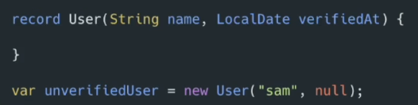

En este ejemplo, se crea la instancia de un nuevo usuario indicando como fecha de verificado null. Es obvio que lo que se quiere indicar es que el usuario no está verificado.

No hay que confiar en la ausencia de data (null) para expresar estados específicos, como "todavía no", "pendiente".

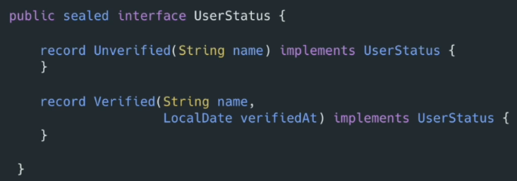

Tenemos que usar tipos `sealed` apropiados, en este caso `Unverified` y `Verified`. Notar como el estado `Unverified` no usa el campo fecha.

De esta forma, podemos modelar la transición de estados de una manera más límpia.

### Loan Application Workflow

Vamos a modelar un flujo de trabajo para una aplicación de préstamos. El objetivo es:

- Diseñar e implementar un sistema de procesamiento de préstamos usando características de Java modernas. Este sistema modela el ciclo de vida de diferentes aplicaciones de préstamos, evalua la elegibilidad del solicitante y determina el resultado (si el préstamo se aprueba o deniega) con una tasa de interés potencial (si se aprueba).

Por ahora no vamos a usar SpringBoot. Lo usaremos más adelante.

Nuestro dominio consta de:

- Applicant (name, credit score, income)
  - renta anual (income) en moneda local
  - credit score es una puntuación de confianza financiera
- Loan Terms (amount, duration)
  - importe que el applicant pide en moneda local, duración en años
- 3 types of Loan
  - Personal Loan
  - Property Loan
  - Auto Loan

- Property loan depende de Property type
  - Residential (address, rooms count)
  - Commercial (address, business type)
    - business type puede ser Retail, Office
- Auto loan depende de Vehicle
  - Car (make, year)
  - Motorcycle (make, engineCC)

- La aplicación de préstamos pasa por estos estados:
  - Submitted
  - Reviewed
  - Approved
  - Denied
- Submitted -> Reviewed
 - Se revisará el credit score del applicant y su detalle de renta anual. Si el applicant no cumple los requisitos, se le denegará el préstamo.
 - 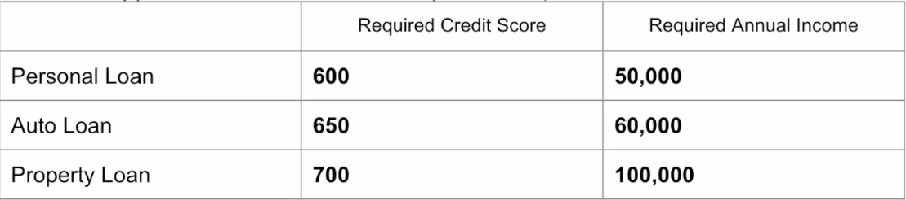
- Reviewed -> Approved
  - Al aprobarse el préstamo, se decidirá la tasa de interés del préstamo basado en las condiciones siguientes:
  - 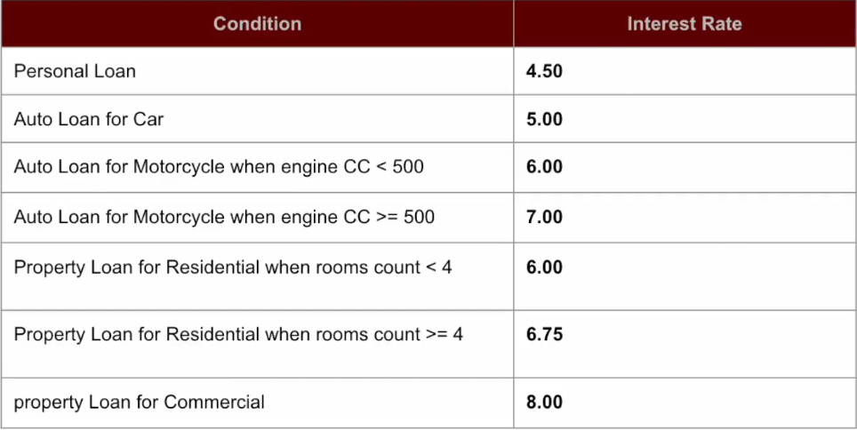

### Loan Models

Vamos a crear los distintos modelos de este proyecto.

En `src/java/com/jmunoz/sec05` creamos los packages/clases siguientes:

- `domain`
  - `Applicant`: Record
  - `LoanTerms`: Record
  - `LoanApplication`: Record que contiene Applicant y LoanTerms
  - `Address`: Record
  - `Property`: Es una interface Sealed con dos types (records), Residential y Commercial
  - `BusinessType`: Es un enum y no un sealed type porque no tiene ninguna propiedad
  - `Vehicle`: Es una interface Sealed con dos types, Car y Motorcycle
  - `Loan`: Es una interface Sealed con tres types, PersonalLoan, PropertyLoan y AutoLoan

### Modeling Loan Status & Processor

En `src/java/com/jmunoz/sec05` creamos los packages/clases siguientes:

- `domain`
  - `LoanStatus`: Es una interface Sealed con los types, Submitted, Reviewed, Approved y Denied
  - `LoanProcessor`: Es una interface que modela el comportamiento de LoanStatus (no es Sealed)

### Loan State Transition - Implementation

En `src/java/com/jmunoz/sec05` creamos los packages/clases siguientes:

- `impl`
  - `LoanProcessorImpl`: Implementación de la interface LoanProcessor.

### Loan Workflow - Demo

En `src/java/com/jmunoz/sec05` creamos la clase siguiente:

- `Demo`: Clase main para hacer las pruebas.

Ejecutar `Demo` para probar.

### [Clarification] - Why Does Loan Status Contain Loan?

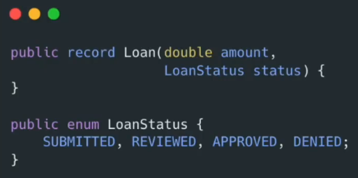

La imagen de arriba muestra como diseñaríamos normalmente. Loan contiene amount y LoanStatus.

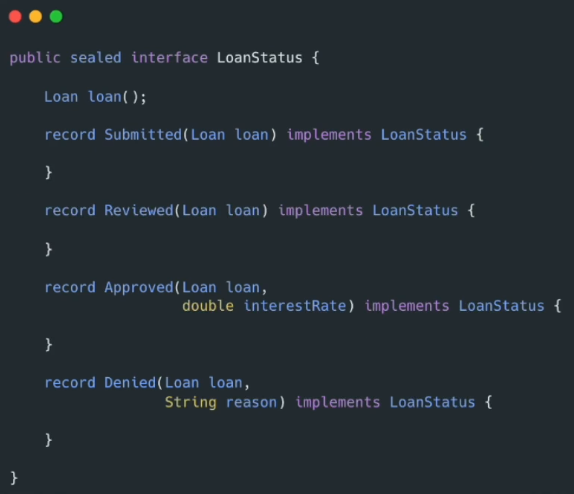

Pero en nuestro diseño, que podemos ver en la imagen de arriba, tenemos los distintos Loan Status, que contienen Loan.

- ¿Es esto correcto?
  - Si. Nuestro objetivo es modelar la transición de estados como entidades de primera clase.
- Estos es orientado a la data y conducido por el dominio (domain driven)
  - Sigue la transición histórica.
  - Cada estado tiene su propio conjunto de propiedades.
  - El comportamiento depende de Loan Status primero y luego de Loan.
- Útil cuando
  - Tratamos con flujos de trabajo / procesos de la aplicación que contienen muchos estados.
  - Necesitamos datos ricos por estado en el flujo de trabajo.
  - Nos importa la inmutabilidad y las transiciones de estado explícitas.

## Modeling Uncertainty With Types

Esta sección y la siguiente sobre gestión de errores están muy relacionadas.

En la vida real, cuando se hace una petición, podemos obtener una respuesta, pero también podemos no obtenerla.

Por ejemplo, `getCustomerInformationById`, si el id está presente en BD obtendremos la información del cliente, sino, obtendremos null o un mensaje de error.

¿Cómo podemos modelar esta incertidumbre en nuestro código, de una forma clara, segura y explícita?

### Option Type

`Option<T>`

- Representa un valor que puede estar presente o no.
- Vamos a reescribir `Optional<T>` usando `sealed type`.
- Hay que verlo como un ejercicio - ¡Podemos crear nuevos tipos usando esto como idea!
  - Cosa que vamos a hacer

En `src/java/com/jmunoz/sec06` creamos los packages/clases siguientes:

- `lec01`
  - `Option`: Es un `sealed interface`, genérico.
    - Internamente los `record` que contiene son `Present<T>` y `Absent<T>`.
    - Tiene también métodos estáticos helper.
  - `Demo`: Clase main para hacer pruebas.

### Either Type

`Either<L, R>`

- Representa dos posibles resultados.
- Un valor que puede ser de dos tipos - ¡pero nunca de ambos!
  - O Left(L) o Right(R)
  - La parte izquierda suele usarse como un fallo (tipo error) y la parte derecha como un tipo éxito.
  - También puede usarse para crear un tipo de `sealed type`.

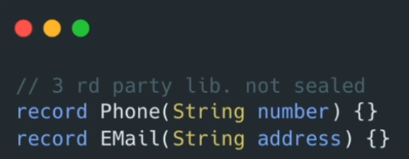

Por ejemplo, podemos crear un `sealed interface` y llamar al método `contact`. Podemos tener un par de opciones como `EMail` y `Phone`.

Como vemos en la imagen, usamos una librería de terceros que contiene estos dos `record types`, `Phone` y `EMail`. No son `sealed`.

Pero usando el tipo `Either` genérico, podemos devolver o `Phone` o `EMail`, elecciones, sin usar un `sealed type`.

El tipo `Either` no existe en Java, pero es fácil de crear.

En `src/java/com/jmunoz/sec06` creamos los packages/clases siguientes:

- `lec02`
  - `Either`: Es un `sealed interface`, genérico.
    - Internamente los `record` que contiene son `Left<L, R>` y `Right<L, R>`.
    - Tiene también métodos estáticos helper.
  - `Demo`: Clase main para hacer pruebas.

### [Clarification] - What About More Than 2 Options?

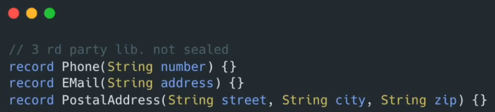

Cuando tenemos 2 opciones, podemos usar el tipo `Either`. ¿Qué pasa si tenemos 3 opciones como en la imagen?

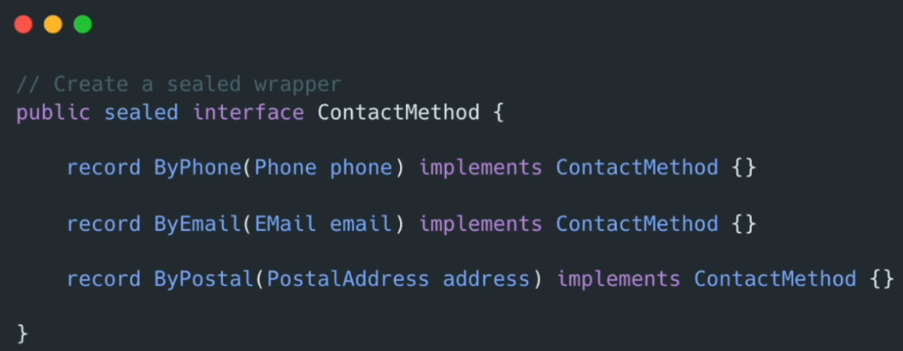

En estos casos, podemos crear un wrapper `sealed type` como el que se ve en la imagen de arriba. Tendremos un `record` por cada opción.